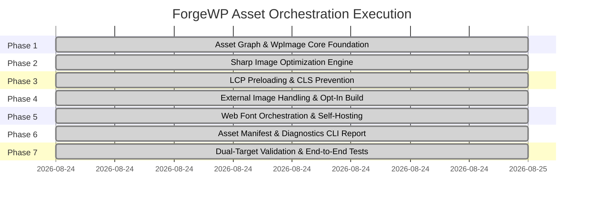

# ForgeWP Asset Orchestration & Optimization Roadmap

**Status**: Completed (100% Green — All 7 Milestones Delivered)  
**Author**: Antigravity (Advanced Agentic Pair-Programmer) & Core Maintainer  
**Target Version**: `@forgewp/compiler@0.5.0` & `@forgewp/react@0.4.0`  
**Related Spec**: [ForgeWP_Asset_Orchestration_Agent_Brief.md](./ForgeWP_Asset_Orchestration_Agent_Brief.md)

---

## 1. Executive Summary

Asset Orchestration in ForgeWP establishes a **zero-runtime-overhead, build-time compilation pipeline** that bridges modern React/Next.js/Astro image and font DX with high-performance WordPress PHP block themes.

### Core Guarantees:
1. **Zero CLS (Cumulative Layout Shift)**: Intrinsic dimensions and aspect ratios are inferred at build time and emitted into HTML/PHP markup.
2. **Sub-second LCP (Largest Contentful Paint)**: Responsive `<link rel="preload">` tags equipped with `imagesrcset` and `imagesizes` are automatically injected high in `<head>` in `header.php`.
3. **GDPR-Compliant, Self-Hosted Fonts**: Google Fonts declared in `wp.config.ts` are downloaded at build time as WOFF2 binaries, served locally via `assets/fonts/fonts.css`, with critical weights preloaded in `<head>`.
4. **Intelligent Unused Font Weight Scanner**: Scans project TSX/JSX/CSS source for Tailwind font weight classes and warns when configured font weights are unused, showing exact byte savings.
5. **Universal `<WpImage>` Component**: One declarative API that seamlessly handles dynamic WordPress media library attachments (`number` / `field`), local static raster images, and external CDN URLs.

---

## 2. Milestones & Delivery Status



| Milestone | Deliverables | Status |
| :--- | :--- | :--- |
| **Milestone 1: Asset Graph & `<WpImage>` Core** | `<WpImage>` React component, `AssetGraph` AST scanner, `classifyAssetSource()`, and `<forgewp-image>` markup transpiler | **COMPLETED ✅** |
| **Milestone 2: Build-Time Sharp Optimizer** | Sharp image optimizer, responsive WebP variants (480w–1920w), 16px LQIP blur placeholder generator, and SHA256 disk cache | **COMPLETED ✅** |
| **Milestone 3: LCP Preload & Loading Intelligence** | `generatePreloadTags()`, responsive `<link rel="preload">` with `imagesrcset`/`imagesizes`, and `header.php` head injection | **COMPLETED ✅** |
| **Milestone 4: External Image Handling** | Safe remote passthrough mode, opt-in `optimize="build"` remote image fetcher, download cache, and network drop fallbacks | **COMPLETED ✅** |
| **Milestone 5: Web Font Orchestration** | WOFF2 font downloader, local `@font-face` CSS generator (`assets/fonts/fonts.css`), font caching, and critical weight preloads | **COMPLETED ✅** |
| **Milestone 6: Asset Manifest & Diagnostics** | `asset-manifest.json`, exhaustive font weight usage scanner, unused weight detection with KB savings, and terminal diagnostics table | **COMPLETED ✅** |
| **Milestone 7: Dual-Target Validation & E2E** | Dual-target verification across Decoupled React & WordPress Theme exports, full E2E test suite (23 test suites, 208 tests green) | **COMPLETED ✅** |

---

## 3. Architecture & Dual-Target Output

### Input: Unified Declarative React JSX
```tsx
import { WpImage } from '@forgewp/react';

export function Hero() {
  return (
    <section>
      {/* Local Static Image with LCP Priority */}
      <WpImage
        src="/src/assets/hero.png"
        alt="Hero Banner"
        priority={true}
        className="rounded-2xl shadow-xl"
      />

      {/* Dynamic WordPress Attachment by ID */}
      <WpImage src={104} size="large" alt="Media Item" />

      {/* Dynamic Post Featured Image */}
      <WpImage src="featuredImage" size="medium_large" alt="Post Banner" />

      {/* External Opt-In Build Optimization */}
      <WpImage src="https://images.unsplash.com/photo-123" optimize="build" alt="CDN Image" />
    </section>
  );
}
```

### Output: Target 2 — WordPress Theme PHP Templates
- **Dynamic Attachments**: Transpiles to native WordPress `wp_get_attachment_image( 104, 'large', false, array(...) )` and `wp_get_attachment_image( get_post_thumbnail_id( get_the_ID() ), 'medium_large', false, array(...) )`.
- **Local Static & External Build Images**: Emits `" srcset="..." sizes="..." />`.
- **Header Preloads**: Injects responsive `<link rel="preload" as="image" imagesrcset="..." imagesizes="...">` and `<link rel="preload" as="font" type="font/woff2" crossorigin>` in `header.php`.
- **Self-Hosted Typography**: Enqueues `assets/fonts/fonts.css` via `wp_enqueue_style('forgewp-fonts')`.

---

## 4. Test Suite Verification Summary

```text
 ✓ test/assets/markup-processor-image.test.js (4 tests)
 ✓ test/assets/preload-generator.test.js (4 tests)
 ✓ test/assets/font-orchestrator.test.js (4 tests)
 ✓ test/assets/diagnostics-report.test.js (4 tests)
 ✓ test/assets/asset-graph.test.js (5 tests)
 ✓ test/assets/external-fetcher.test.js (5 tests)
 ✓ test/assets/image-optimizer.test.js (6 tests)
 ✓ test/assets/asset-orchestration-e2e.test.js (5 tests)
 ✓ test/blocks/tier1-golden.test.js (6 tests)
 ✓ test/blocks/tier1b-existing-regressions.test.js (7 tests)
 ✓ test/blocks/tier2-parse-check.test.js (12 tests)
 ✓ test/blocks/tier3-real-components.test.js (23 tests)
 ✓ test/blocks/tier4-scanner.test.js (6 tests)
 ✓ test/blocks/template-literal.test.js (9 tests)
 ✓ test/blocks/attribute-prop-fallback.test.js (4 tests)
 ✓ test/functions/forms.test.js (56 tests)
 ✓ test/functions/load-config.test.js (5 tests)
 ✓ test/functions/menus.test.js (3 tests)
 ✓ test/functions/front-page-language.test.js (4 tests)
 ✓ test/functions/virtual-plugin.test.js (4 tests)
 ✓ test/functions/backwards-compat.test.js (3 tests)
 ✓ test/functions/validate-critical-files.test.js (3 tests)
 ✓ test/hydration/is-interactive.test.js (26 tests)

 Test Files  23 passed (23)
      Tests  208 passed (208)
```
