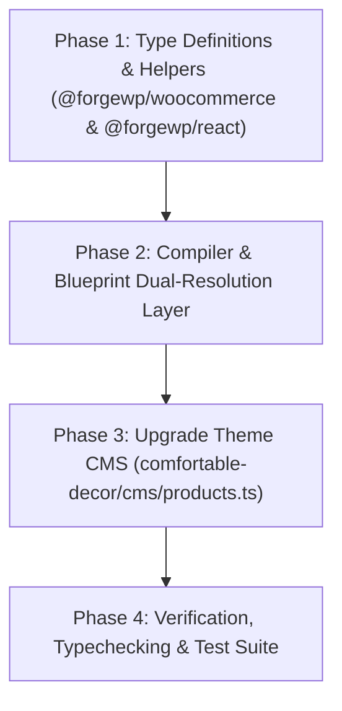

# ForgeWP CMS Data Typing & Schema Architecture Roadmap

> **Authoritative Specification & Execution Plan**  
> **Status:** ✅ COMPLETED (All Phases 1–5 Implemented & Verified)  
> **Target:** Monorepo `@forgewp` packages & theme projects (`comfortable-decor`, `starter`, `create-forgewp`)

---

## 1. Executive Summary & Problem Statement

### The Problem
In early starter prototypes, seed data inside the `cms/` folder (such as `cms/products.json`, `cms/mock-data.json`, and `cms/menus.json`) was authored as raw, untyped JSON. 

While functional at runtime, this created a major **Developer Experience (DX) gap**:
1. **Zero Autocomplete / Discovery**: Developers had no way of knowing what WooCommerce or WordPress natively supports (e.g. `dimensions.length/width/height`, `weight`, `sku`, `manage_stock`, `stock_status`, `attributes`, `variations`, `downloads`) without opening WordPress Admin.
2. **No Compile-time Validation**: Typos in critical enums (e.g. writing `"in_stock"` instead of `"instock"`) went unnoticed until runtime.
3. **Inconsistent CMS Conventions**: While `site-options.ts` and `theme-mods.ts` use modern TypeScript helpers (`defineWpOptions`), products, menus, and posts were untyped JSON.

### The Solution
Upgrade ForgeWP's `cms/` architecture to support **First-Class Typed TypeScript Seed Files** (with `defineProducts()`, `defineWpPosts()`, `defineWpMenus()`), while maintaining **100% Backwards Compatibility** with existing `.json` files and providing `$schema` support for developers who prefer raw JSON.

---

## 2. Monorepo CMS Inventory & File Classifications

All files in `cms/` fall into two strictly separated categories:

```
cms/
├── [Category A: Static Seed / Schema Definitions] (Authored by Devs, Typed via .ts or .json + schema)
│   ├── products.ts (or products.json)      ──> WooCommerce Catalog & Variations
│   ├── mock-data.ts (or mock-data.json)    ──> WP Posts, Pages, & Custom Post Types
│   ├── menus.ts (or menus.json)            ──> Navigation Menu Trees
│   ├── site-options.ts                     ──> Global WordPress Site Options
│   ├── theme-mods.ts                       ──> Customizer Live Theme Modifications
│   ├── translations.ts (or .json)          ──> Localization Dictionary Strings
│   ├── editables/*.ts                      ──> Visual Editable Block/Page Schemas
│   └── forms/*.ts                          ──> Headless Form Schema Definitions
│
└── [Category B: Dev Server Runtime Storage] (Automated JSON Logs, Written by Dev Server Middlewares)
    ├── users.json                          ──> Local Dev Auth Accounts
    ├── sessions.json                       ──> Local Dev Active Auth Sessions
    └── email-logs.json                     ──> Simulated Dev Outgoing Email Inbox
```

---

## 3. Core Architectural Principles & Invariants

> [!IMPORTANT]
> **Strict Non-Breaking Invariant:** Any change made to the framework **MUST NOT BREAK** older/completed projects in the monorepo.
> 
> Resolution Order:
> $$\text{1. Look for } \texttt{cms/<file>.ts} \longrightarrow \text{2. If not found, fall back to } \texttt{cms/<file>.json}$$

1. **Dual Format Resolution**:
   The compiler and Vite runtime must automatically detect whether `cms/products.ts` or `cms/products.json` exists, resolving seamlessly without requiring configuration.
2. **Generics & Custom Meta Extensibility**:
   While standard WordPress/WooCommerce fields must be strictly typed, Custom Post Types (e.g. `project`, `event`, `property`) must allow arbitrary custom fields and `meta: { ... }` via TypeScript generics.
3. **Zero Required Migrations**:
   Legacy projects (`starter`, existing client themes) using `.json` will continue to build, typecheck, and export without modifying a single line of code.

---

## 4. Phase-by-Phase Implementation Plan



---

### Phase 1: Type Definitions & Helpers

#### 1.1 `@forgewp/woocommerce`
- **File**: `packages/woocommerce/src/hooks.ts` and `packages/woocommerce/src/types.ts`
- **Deliverables**:
  - Export complete, fully JSDoc-commented `WooCommerceProduct` interface covering:
    - **General**: `price`, `regular_price`, `sale_price`, `on_sale`, `date_on_sale_from`, `date_on_sale_to`
    - **Inventory**: `sku`, `manage_stock`, `stock_quantity`, `stock_status` (`"instock" | "outofstock" | "onbackorder"`), `sold_individually`
    - **Shipping**: `weight`, `dimensions` (`{ length, width, height, unit? }`), `shipping_class`
    - **Linked Products**: `upsell_ids`, `cross_sell_ids`
    - **Attributes & Variations**: `attributes` (`{ name, options, variation? }[]`), `variations` (`ProductVariation[]`)
    - **Virtual & Downloadable**: `virtual`, `downloadable`, `downloads` (`{ id?, name, file_url }[]`)
    - **Taxonomies**: `categories`, `tags`, `brand`
    - **Reviews**: `average_rating`, `rating_count`, `reviews`
  - Export `defineProducts(products: WooCommerceProduct[]): WooCommerceProduct[]` helper.
  - Generate `$schema` JSON Schema for `products.schema.json`.

#### 1.2 `@forgewp/react`
- **File**: `packages/react/src/config.ts` (or `packages/react/src/types.ts`)
- **Deliverables**:
  - Export `defineWpPosts<T>(posts: WpPostsConfig<T>): WpPostsConfig<T>` supporting standard `post`/`page` types plus extensible Custom Post Types with custom meta fields.
  - Export `defineWpMenus(menus: Record<string, WpMenuItem[]>): Record<string, WpMenuItem[]>`.
  - Export `defineWpUsers(users: WpUser[]): WpUser[]`.
  - Export `defineWpRoles(roles: Record<string, string[]>): Record<string, string[]>`.
  - Export `defineTranslations(translations: Record<string, Record<string, string>>): Record<string, Record<string, string>>`.

---

### Phase 2: Compiler & Blueprint Dual-Resolution Layer

#### 2.1 Virtual WordPress Module (`packages/compiler/templates/wordpress.tsx`)
Update virtual module resolver to support both TypeScript and JSON:
```ts
// Check for .ts module first, fallback to .json
import mockData from '../../cms/mock-data';
import menusData from '../../cms/menus';
import translationsData from '../../cms/translations';
```

#### 2.2 Blueprints & Scaffold Validation (`packages/compiler/lib/blueprints.js` & `validate.js`)
- Update blueprint discovery to check for `.ts` before scaffolding `.json`.
- Provide modern `.ts` starter templates for newly generated projects (`create-forgewp`).

#### 2.3 Vite Dev Server Watcher (`vite.config.ts`)
Update dev server watcher pattern:
```ts
server.watcher.add([
  path.resolve(__dirname, 'cms/*.json'),
  path.resolve(__dirname, 'cms/*.ts'),
]);
```

---

### Phase 3: Upgrade `comfortable-decor` Storefront

#### 3.1 Convert `comfortable-decor/cms/products.json` $\rightarrow$ `cms/products.ts`
- Author `comfortable-decor/cms/products.ts` using `defineProducts([...])`.
- Enrich product catalog items with structured:
  - `dimensions: { length: 59, width: 52, height: 79, unit: 'cm' }`
  - `weight: 4.8`
  - `sku: "AAC-AA51-OAK"`
  - `stock_status: "instock"`
  - `attributes` & `variations`
  - `categories` & `tags`
- Update `comfortable-decor/src/data/products.ts` to import typed `products` directly from `../../cms/products`.

#### 3.2 (Optional) Modernize `cms/mock-data.json` and `cms/menus.json`
- Migrate `cms/mock-data.json` $\rightarrow$ `cms/mock-data.ts` using `defineWpPosts()`.
- Migrate `cms/menus.json` $\rightarrow$ `cms/menus.ts` using `defineWpMenus()`.

---

### Phase 4: Verification & Test Suite

1. **TypeScript Typecheck**:
   ```bash
   pnpm --filter comfortable-decor exec tsc --noEmit
   pnpm --filter @forgewp/woocommerce exec tsc --noEmit
   pnpm --filter @forgewp/react exec tsc --noEmit
   ```
2. **Compiler Unit Tests**:
   ```bash
   pnpm --filter @forgewp/compiler test
   ```
3. **Vite Dev Server & HMR**:
   Run `pnpm dev` in `comfortable-decor` and confirm that modifying `cms/products.ts` immediately triggers hot module reload without errors.
4. **WordPress Theme Build & Export**:
   Run `pnpm export` in `comfortable-decor` and verify clean theme compilation, island code-splitting, and LocalWP sync.

---

## 5. Summary of Key Files

| Package / Directory | File Path | Scope of Changes |
| :--- | :--- | :--- |
| **`packages/woocommerce`** | `src/hooks.ts`, `src/index.ts` | Add `WooCommerceProduct` contract & `defineProducts` helper |
| **`packages/react`** | `src/config.ts`, `src/index.ts` | Add `defineWpPosts`, `defineWpMenus`, `defineTranslations` |
| **`packages/compiler`** | `templates/wordpress.tsx`, `lib/blueprints.js` | Dual `.ts`/`.json` resolution & scaffolding |
| **`comfortable-decor`** | `cms/products.ts`, `src/data/products.ts` | Replace mock JSON with typed `cms/products.ts` |

---

*This specification serves as the master checklist for implementing full CMS data typing and schema tooling across ForgeWP.*
