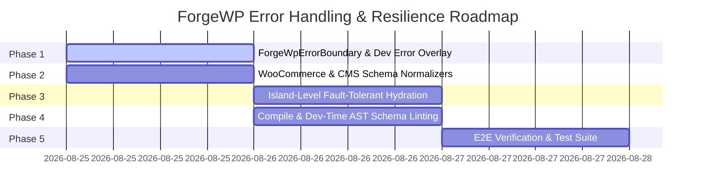

# ForgeWP Error Handling, Resilience & Developer Experience (DX) Roadmap

**Status**: Proposed / Initialized  
**Author**: Antigravity (Advanced Agentic Pair-Programmer) & Core Maintainer  
**Target Version**: `@forgewp/react@0.5.0`, `@forgewp/woocommerce@0.3.0`, `@forgewp/compiler@0.5.0`  
**File Location**: `/FORGEWP_ERROR_HANDLING_DX_ROADMAP.md`

---

## 1. Executive Summary & Core Mission

A key principle of modern web frameworks (Next.js, Remix, Astro) is **Zero Silent Failures**: a developer should never be left staring at a blank white screen when a runtime exception, undefined property, or schema mismatch occurs.

In ForgeWP, where React JSX interfaces with WordPress and WooCommerce schemas (dynamic fields, polymorphic dimension objects, attachment IDs, REST payloads), runtime robustness is paramount.

### Core Guarantees:
1. **No Blank Screens**: Runtime errors in components, modals, or pages are caught by built-in Error Boundaries and surfaced via a modern **ForgeWP Dev Error Overlay**.
2. **Fault-Tolerant Hydration**: A crash in one interactive island (e.g. cart drawer or review modal) must never crash the entire page or break surrounding static HTML.
3. **Defensive Schema Normalization**: Polymorphic CMS data (such as WooCommerce dimensions `{length, width, height, unit}` vs strings) is automatically normalized with safe formatting helpers.
4. **Actionable Diagnostics**: Clear, pinpoint error messages with exact file paths, line numbers, and suggestions on how to fix common pitfalls.

---

## 2. Phased Architecture & Execution Plan

---

## 3. Detailed Milestones

### Milestone 1: Built-in `<ForgeWpErrorBoundary>` & Dev Error Overlay (`@forgewp/react`)
- [ ] **Create `<ForgeWpErrorBoundary>`**:
  - Catches React rendering errors at the `<Router>` level, page level, and layout level.
  - In Development: Renders `<ForgeWpDevErrorOverlay>` with stack traces, component hierarchies, and highlighted code snippets.
  - In Production: Renders customizable graceful fallbacks so the remainder of the site (Header, Navigation, Footer) stays alive.
- [ ] **Build `<ForgeWpDevErrorOverlay>` Component**:
  - Modal overlay with dark-mode aesthetic, syntax-highlighted error trace, and "Copy Error" button.
  - Specific smart detection for common errors:
    - *"Objects are not valid as a React child (found: object with keys ...)"* $\rightarrow$ Suggests using `formatDimensions()` or rendering specific keys.
    - *"Cannot read properties of undefined"* $\rightarrow$ Suggests safe navigation (`?.`) or fallback default data.
- [ ] **Auto-Wrap in `<Router>`**:
  - Update `@forgewp/react`'s `<Router>` component so all routes are protected by default without manual developer setup.

---

### Milestone 2: Defensive Schema Normalizers & Formatting Helpers (`@forgewp/woocommerce` & `@forgewp/react`)
- [ ] **WooCommerce Formatters in `@forgewp/woocommerce`**:
  - `formatDimensions(dimensions: ProductDimensions | string, options?: { fallback?: string; separator?: string })`:
    - Handles `{ length: 59, width: 52, height: 79, unit: 'cm' }` $\rightarrow$ `"59 × 52 × 79 cm"`.
    - Handles flat strings `"59 × 52 × 79 cm"` $\rightarrow$ `"59 × 52 × 79 cm"`.
    - Handles `undefined` / `null` $\rightarrow$ Returns fallback or `""`.
  - `formatWeight(weight: number | string, unit?: string)`:
    - Handles `6.5` $\rightarrow$ `"6.5 kg"`.
  - `formatPrice(price: number, options?: { currency?: string; locale?: string })`:
    - Safe currency formatter handling numeric prices, string numbers, and currency symbols.
- [ ] **Universal Safe Object Unwrapper in `@forgewp/react`**:
  - `safeText(val: any, fallback?: string)`: Safely renders any value as text, preventing object-child crashes.

---

### Milestone 3: Island-Level Fault-Tolerant Hydration (`@forgewp/compiler`)
- [ ] **Isolate Interactive Islands in `generate-theme.js`**:
  - Wrap every compiled dynamic hydration island (e.g. `cart-drawer`, `product-hotspot`, `quick-view-modal`) with an individual micro error boundary.
  - If a JavaScript crash happens inside a specific widget, only that widget displays an inline error placeholder while the rest of the WordPress block theme remains interactive.
- [ ] **WordPress Admin / Gutenberg Fallbacks**:
  - Provide a safe edit-view fallback in Gutenberg editor blocks if custom block attributes contain unexpected types.

---

### Milestone 4: Dev-Time AST Schema Linting & Pre-Flight Checks (`@forgewp/compiler`)
- [ ] **CMS Mock Validator**:
  - Validate `cms/mock-data.ts`, `cms/products.ts`, `cms/menus.ts`, and `cms/site-options.ts` on startup.
  - Warn if required fields (`id`, `title`, `url`, `price`) are missing or have mismatched types.
- [ ] **JSX Object Child Scanner**:
  - AST lint check in `forgewp` CLI checking for direct rendering of known complex objects in JSX (e.g. `{product.dimensions}`).

---

### Milestone 5: Verification & End-to-End Test Suite
- [ ] **Unit Tests**:
  - Unit tests for `<ForgeWpErrorBoundary>` and `<ForgeWpDevErrorOverlay>`.
  - Unit tests for `formatDimensions()`, `formatWeight()`, and `formatPrice()`.
- [ ] **Monorepo Integration**:
  - Update `comfortable-decor` and test all shop filters, quick view modals, cart interactions, and error scenarios.
- [ ] **Documentation**:
  - Add "Error Handling & Safe Data Formatting" section to ForgeWP documentation.

---

## 4. Deliverables Matrix

| Component | Target Package | Status |
| :--- | :--- | :--- |
| `<ForgeWpErrorBoundary>` | `@forgewp/react` | Planned 📋 |
| `<ForgeWpDevErrorOverlay>` | `@forgewp/react` | Planned 📋 |
| `formatDimensions()` & `formatWeight()` | `@forgewp/woocommerce` | Planned 📋 |
| Island Isolation Wrapper | `@forgewp/compiler` | Planned 📋 |
| Dev AST Schema Linter | `@forgewp/compiler` | Planned 📋 |
