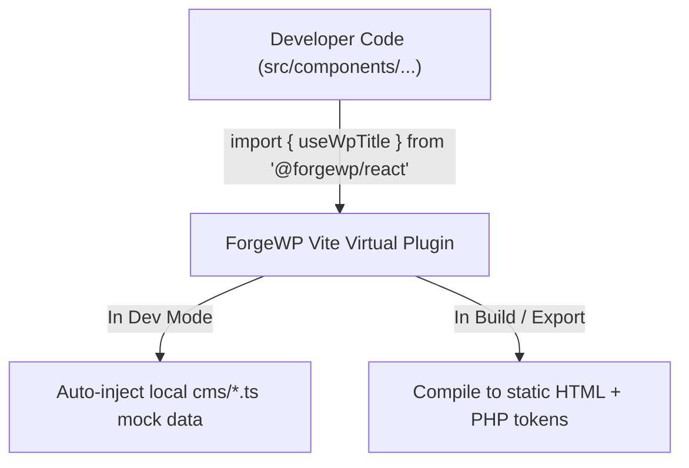

# ForgeWP Zero-Clutter Virtual Module Architecture Roadmap

> **Authoritative Specification & Strategic Roadmap**  
> **Goal:** Transition all generated framework internals (`src/.forgewp/*`) into a zero-clutter Vite Virtual Module System and hidden `.forgewp/` cache (identical to `.next/` or `.astro/`).  
> **Target:** Monorepo `@forgewp` packages & theme projects (`comfortable-decor`, `starter`, `create-forgewp`).

---

## 1. Executive Summary & Problem Statement

### The Problem Today
In current theme projects, the framework generates internal scaffolding files directly inside the developer's source folder:
```
my-theme/
├── src/
│   ├── .forgewp/                     <-- Generated framework plumbing in user src/
│   │   ├── wordpress.tsx             <-- Mock data bridge + re-export facade
│   │   ├── SEO.tsx                   <-- Internal head/meta wrapper
│   │   ├── PresetsStyle.tsx          <-- Theme styling injection
│   │   └── forgewp-config.ts         <-- Internal configuration mirror
│   ├── components/
│   └── app/
```

While functional, having generated files in `src/.forgewp/` introduces several drawbacks:
1. **Source Clutter**: Developers see large, generated plumbing files in their `src/` directory alongside their own code.
2. **Indirect Import Patterns**: Developers are asked to import from `@/wordpress` or `src/.forgewp/wordpress` rather than standard canonical package names (`@forgewp/react`, `@forgewp/woocommerce`, `@forgewp/auth`).
3. **Risk of Accidental Edits**: Developers might edit `src/.forgewp/wordpress.tsx`, only to have `forgewp repair` or preflight validation overwrite their changes.

### The Solution: Zero-Clutter Architecture
Transition ForgeWP to a **Vite Virtual Module & Hidden Cache System**:
1. **100% Clean `src/` Directory**: No `.forgewp/` folder exists inside `src/`.
2. **Hidden Root Cache (`.forgewp/`)**: Any build cache or auto-generated typings live in a root hidden directory `.forgewp/` (like Next.js `.next/` or Astro `.astro/`).
3. **Direct Canonical Package Imports**: Developers import directly from official packages with full IDE autocomplete:
   ```tsx
   import { useWpTitle, useWpPost, WpQueryLoop } from '@forgewp/react';
   import { useCart, useProduct, ProductPrice } from '@forgewp/woocommerce';
   import { useAuth, WpLoginForm } from '@forgewp/auth';
   ```
4. **Dev-Mode Virtual Mock Injection**: The ForgeWP Vite plugin automatically injects local `cms/*.ts` mock data behind the scenes without requiring a physical bridging file in `src/`.

---

## 2. Technical Architecture & Design

### 2.1 The Vite Virtual Runtime Plugin (`virtual:forgewp-runtime`)
The compiler provides a lightweight Vite dev server plugin that operates at the bundler layer:



#### How it works:
1. When Vite runs in dev mode (`pnpm dev`), the ForgeWP plugin intercepts imports to `@forgewp/react`, `@forgewp/woocommerce`, and `@forgewp/auth`.
2. It dynamically loads the project's local `cms/products.ts`, `cms/mock-data.ts`, `cms/menus.ts`, and `cms/translations.ts` and provides them to the React Context providers.
3. No physical TypeScript files need to be written into `src/`.

---

### 2.2 PresetsStyle & SEO Modernization

| Current File | New Architecture Destination | Developer Usage |
| :--- | :--- | :--- |
| `src/.forgewp/SEO.tsx` | Exported directly from `@forgewp/react` or `@forgewp/seo` | `<WpHead title="..." />` or `<SEO />` from `@forgewp/react` |
| `src/.forgewp/PresetsStyle.tsx` | Injected automatically by Vite plugin into `index.html` / `app.html` shell | Zero manual imports required |
| `src/.forgewp/forgewp-config.ts` | Loaded in-memory by compiler via `wp.config.ts` | Read directly by runtime hooks |
| `src/.forgewp/wordpress.tsx` | Replaced by direct package imports (`@forgewp/react`, etc.) | Direct canonical package imports |

---

### 2.3 Backwards-Compatibility Layer
To ensure older projects and themes migrating to the new version do not break:
- The Vite plugin will include an alias:
  ```ts
  resolve: {
    alias: {
      '@/wordpress': '@forgewp/react',
      'src/.forgewp/wordpress': '@forgewp/react',
    }
  }
  ```
- If a legacy project still imports from `@/wordpress`, Vite resolves it seamlessly to `@forgewp/react`.

---

## 3. Phased Implementation Plan

### Phase 1: Vite Virtual Resolver & Runtime Mock Injector — ✅ **COMPLETED**
- **Package**: `packages/compiler`, `packages/react`
- **Deliverables**:
  - [x] Implement `forgewpVirtualPlugin()` in `@forgewp/compiler`.
  - [x] Export unified runtime components (`SEO`, `PresetsStyle`) in `@forgewp/react`.
  - [x] Implement seamless dev-mode mock data binding via `virtual:forgewp-runtime`.

---

### Phase 2: Compiler Engine & Preflight Validator Migration — ✅ **COMPLETED**
- **Package**: `packages/compiler`
- **Deliverables**:
  - [x] Update `packages/compiler/lib/validate.js`: remove `src/.forgewp/*` from `validateCriticalFiles`.
  - [x] Update `packages/compiler/lib/blueprints.js`: remove legacy `src/.forgewp` blueprints.
  - [x] Update `packages/compiler/bin/doctor.js` and `repair.js` to enforce zero-clutter `src/`.
  - [x] Add compiler unit tests verifying clean directory invariants.

---

### Phase 3: Monorepo Theme Clean-Up & Scaffolding Updates — ✅ **COMPLETED**
- **Projects**: `comfortable-decor`, `packages/starter`, `packages/create-forgewp`
- **Deliverables**:
  - [x] Delete `src/.forgewp/` from `comfortable-decor`, `packages/starter`, and `create-forgewp` template.
  - [x] Update all internal component imports in `comfortable-decor` from `@/wordpress` to `@forgewp/react`, `@forgewp/woocommerce`, `@forgewp/auth`.
  - [x] Update `packages/starter/src/app` to use `@forgewp/react`.
  - [x] Update `packages/create-forgewp/lib/apply-config.js` to scaffold zero-clutter project structures.

---

### Phase 4: Global Verification, Diagnostics & Backwards Compatibility — ✅ **COMPLETED**
- **Verification Suite**:
  - [x] Monorepo full typechecks across all packages (`tsc --noEmit`).
  - [x] Backwards-compatibility tests for legacy `@/wordpress` and `.forgewp/wordpress` imports (`test/functions/backwards-compat.test.js`).
  - [x] End-to-end theme export and WordPress PHP template generation (`comfortable-decor` and `@forgewp/starter`).
  - [x] Diagnostics verification with `forgewp doctor` reporting 0 errors across themes.

---

## 4. Expected Developer Experience (After Upgrade)

### Clean Monorepo Directory Tree:
```
my-theme/
├── cms/                                <--- Fully Typed Source of Truth
│   ├── products.ts                     (defineProducts)
│   ├── mock-data.ts                    (defineWpPosts)
│   ├── menus.ts                        (defineWpMenus)
│   └── translations.ts                 (defineTranslations)
├── src/                                <--- 100% User Code (ZERO framework clutter)
│   ├── app/
│   │   ├── layouts/
│   │   └── pages/
│   ├── components/
│   └── index.css
├── wp.config.ts                        <--- Theme Configuration
├── vite.config.ts                      <--- Vite Config with ForgeWP Plugin
├── package.json
└── .forgewp/                           <--- Hidden Build & Output Cache (.gitignore)
    ├── out/                            (Compiled WordPress PHP Theme)
    └── my-theme.zip                    (Installable Theme ZIP)
```

---

*This specification represents the completed architectural transition of ForgeWP into a zero-clutter virtual module framework.*
