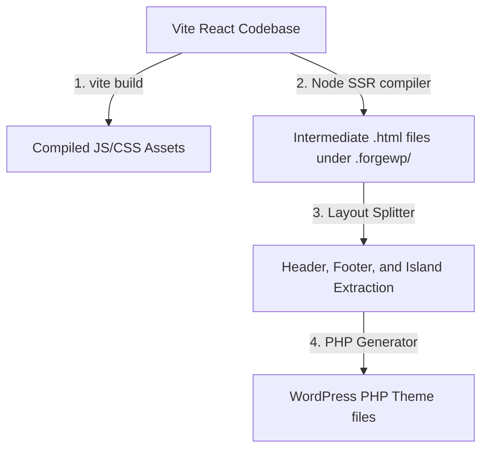
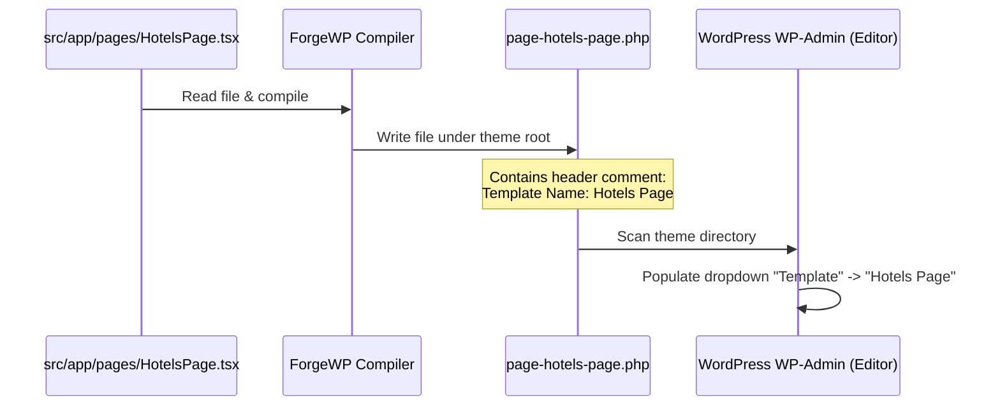

# ForgeWP Framework: Compilation & Translation Architecture

This document provides a comprehensive technical overview of how the ForgeWP compiler translates a modern React application into a high-performance WordPress Classic theme, how page templates map to the WordPress admin panel, and how to resolve Polylang translation considerations.

---

## 1. The Compilation Pipeline

The ForgeWP compilation pipeline bridges the gap between Vite React source code and classic WordPress PHP/HTML templates. It operates in four main phases:



### Phase 1: Vite Asset Production
When you run `pnpm run export` inside the theme folder, Vite compiles the React codebase under the hood. It outputs chunked JavaScript and CSS files in `dist/assets/` and generates a dependency manifest (`dist/.vite/manifest.json`).

### Phase 2: Static SSR Render
The compiler uses Node.js in `packages/compiler/lib/render-theme.mts` to execute server-side rendering (SSR) of your React pages.
* It scans your source components under `src/app/pages/` (such as `HotelsPage.tsx`, `BerUnsPage.tsx`, etc.).
* It renders these page components and static shell components to output intermediate static HTML files inside the local `.forgewp/` folder.
* These files are saved with suffixes like `template-hotels-page.html` and `template-hotels-page-head.html`.

### Phase 3: Layout Splitter & Extraction
The theme generator (`packages/compiler/lib/generate-theme.js`) reads these intermediate static files. 
* It identifies global structural layouts by searching for `<header>` and `<footer>` tags, writing them into `/forgewp-static/header.html` and `/forgewp-static/footer.html`.
* It extracts the main content of each page template by removing the header and footer blocks, writing the rest into `/forgewp-static/content.html` or `/forgewp-static/template-[slug].html`.
* Hydration boundaries (islands wrapped in React `<Hydrate>` tags) are replaced by empty container `<div>` tags in the static markup, containing custom attributes like `data-forgewp-hydrate="navbar"`.

### Phase 4: PHP & Settings Generation
The compiler outputs the native PHP templates (`header.php`, `footer.php`, `page.php`, `functions.php`, etc.).
* **Site Settings & Options**: The compiler parses `cms/site-settings.json` and enqueues the fallback array inside `functions.php`. On render, this data is dynamically overwritten with live options using `get_option()` or `get_theme_mod()`.
* **Menus**: The compiler parses `cms/menus.json` and registers custom theme locations. In `functions.php`, it enqueues a theme activation hook `forgewp_auto_create_pages_and_menus` to register locations and auto-create pages.
* **Hydration payload**: The final dynamic arrays (options, theme modifications, active navigation items, and translations) are enqueued in the header inside `window.forgeWpHydration` and `window.forgeWpTranslations` using `wp_add_inline_script()`.

---

## 2. WordPress Page Template Mapping
### How `HotelsPage.tsx` becomes a WP Admin dropdown option

You may wonder how a page created in WordPress is able to select our custom `HotelsPage.tsx` inside the right-hand **Template** dropdown in the WordPress Block Editor (Gutenberg):



1. **Static HTML Compile**: The compiler reads `src/app/pages/HotelsPage.tsx` and renders it into the intermediate file `.forgewp/template-hotels-page.html`.
2. **Template File Creation**: The layout splitter reads the file, extracts the header/footer, and saves the page body to `forgewp-static/template-hotels-page.html`. It then creates a matching PHP page template file at the theme root directory:
   * File name: `/wp-content/themes/hotelchecker24/page-hotels-page.php`
3. **Template Header Comment**: To register this file as a Custom Page Template in WordPress, the compiler prepends a standard comment header:
   ```php
   <?php
   /**
    * Template Name: Hotels Page
    *
    * @package hotelchecker24
    */
   ```
4. **WP-Admin Dropdown Detection**: Whenever you edit or create a page in the WordPress admin panel, WordPress scans the active theme folder. It parses the top comment blocks of all PHP files. If a file begins with `Template Name: [Name]`, WordPress registers it as a Custom Page Template.
5. **Selection & Meta Storage**: When you select **Hotels Page** in the Gutenberg template selector and publish the page, WordPress saves this association in the `wp_postmeta` database table under the meta key `_wp_page_template` with the value `page-hotels-page.php`.
6. **Rendering**: On page requests, WordPress's native template loader checks the meta value, bypasses the standard `page.php`, and executes `page-hotels-page.php`. This file loads the header, imports the static template `/forgewp-static/template-hotels-page.html`, enqueues scripts, and hydrates `HotelsPage` in the browser!

---

## 3. Polylang & Translation on Static Templates

### Why Polylang is having issues translating the pages

If you create an English translation of a page (e.g. the English version of `/hotels`) and assign it to the same **Hotels Page** template in the WP-Admin, Polylang might appear not to translate the contents.

#### The Root Cause: Hardcoded React markup
When you write text strings (like titles, section headers, or CTA descriptions) directly as hardcoded strings inside a React component (e.g. `HotelsPage.tsx`), they get statically compiled into `template-hotels-page.html`.
Since the PHP template `page-hotels-page.php` simply imports that file:
```php
include get_template_directory() . '/forgewp-static/template-hotels-page.html';
```
WordPress is rendering raw, hardcoded HTML. Polylang's page translation layers (which translate database columns like `post_title` and `post_content`) have no way to intercept or parse raw static HTML files! Thus, both the German page and the English page will load the exact same hardcoded template file, rendering the exact same text.

---

### How to make Page Templates fully translatable

To enable seamless Polylang translations, we must fetch language-specific strings dynamically from the WordPress database instead of hardcoding them in React. There are three key patterns to do this:

### Strategy A: Use Standard WordPress Title & Content (Recommended)
Instead of hardcoding the main page heading and description inside your React page component, pull them dynamically using `useWpTitle()` and `useWpContent()`.

1. **Modify React Component**:
   ```tsx
   import { useWpTitle, useWpContent } from "../.forgewp/wordpress";

   export function HotelsPage() {
     const title = useWpTitle();
     const content = useWpContent();

     return (
       <div className="container py-12">
         {/* Dynamic page title (Polylang translates this via WP Admin) */}
         <h1 className="text-4xl font-bold">{title}</h1>
         
         {/* Dynamic page content description */}
         <div 
           className="text-slate-500 mt-4"
           dangerouslySetInnerHTML={{ __html: content }} 
         />
       </div>
     );
   }
   ```
2. **Translate in WP-Admin**:
   When you translate the page in the WordPress admin panel, Polylang creates a separate post ID for the translation. When rendering the page in English, WordPress loads the English post, and `useWpTitle()` / `useWpContent()` automatically serve the translated English text!

---

### Strategy B: Use Polylang Custom Field Translations (Advanced)
For custom editorial fields, grids, or badges, map them to WordPress custom fields (ACF or native Custom Fields) and fetch them using `useWpCustomField('field_name')`.

1. **Retrieve in React**:
   ```tsx
   import { useWpCustomField } from "../.forgewp/wordpress";

   export function HotelsPage() {
     // Retrieve dynamic subtitle custom field
     const hotelsSubtitle = useWpCustomField("hotels_subtitle", "Von unserer Redaktion handverlesene Hotels");

     return (
       <div>
         <p>{hotelsSubtitle}</p>
       </div>
     );
   }
   ```
2. **Translate in Polylang**:
   Polylang allows you to synchronize and translate custom fields. When translating the page in the WP-Admin, simply write the English value inside the custom field. The framework will automatically fetch the correct translation based on the active post ID!

---

### Strategy C: Register Polylang String Translations (Global Constants)
For static elements like buttons ("Suchen", "Eintragen lassen") or header labels that don't belong to a specific page:

1. **Register strings in `functions.php`**:
   Add this PHP snippet (you can add it under `autoCreationPhp` or CPT filters in `generate-theme.js`):
   ```php
   add_action('init', function() {
       if (function_exists('pll_register_string')) {
           pll_register_string('hotelchecker24', 'Search Button', 'Suchen');
           pll_register_string('hotelchecker24', 'Get Listed', 'Eintragen lassen');
       }
   });
   ```
2. **Expose through Site Options**:
   Map these string translations to options inside the compiler `generate-theme.js` under `options`:
   ```php
   'search_button_label' => function_exists('pll__') ? pll__('Suchen') : 'Suchen',
   ```
3. **Consume in React**:
   ```tsx
   import { useWpOption } from "../.forgewp/wordpress";

   const searchLabel = useWpOption("search_button_label", "Suchen");
   ```
   Polylang allows you to translate these strings under **Languages -> String translations** in the WP-Admin dashboard. It will instantly serve the correct language translation!
