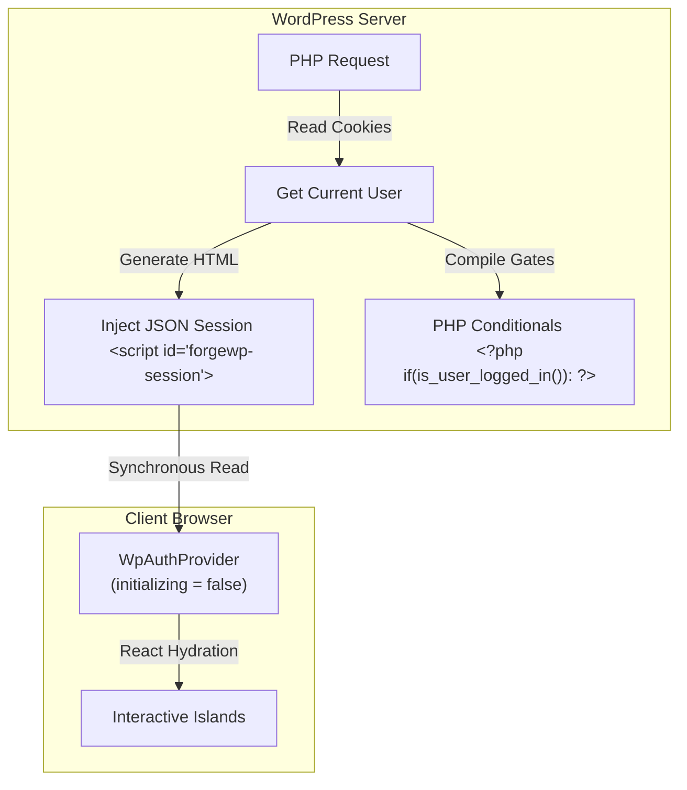

# ForgeWP — Authentication Architecture Roadmap 🔐⚡

This document details the final, architecturally locked technical specification for implementing secure, compile-first **Authentication (Auth)** and **Authorization (Access Control)** features in the **ForgeWP** framework.

---

## 🏗️ Core Architectural Principles

1. **WordPress is the Source of Truth**: Authentication is a server-side concern. We leverage native WordPress cookies, capability engines, and login lifecycles instead of replicating complex client-side SPA state machines.
2. **Compiler First (Compiler APIs > Runtime APIs)**: We push authorization decisions to compilation. Content boundaries and page-level protections are compiled to native PHP checks before rendering, minimizing bundle size and preventing client-side security leaks.
3. **Explicit Hydration (No Framework Magic)**: We avoid magical implicit provider injections. All hydration scopes are explicitly declared via components like `<WpAuthProvider>` or `<AuthBoundary>`.
4. **Zero-Flash Session Bootstrap**: The server injects the initial session data inside a secure, CSP-compliant JSON script block, allowing React to boot with session context synchronously.



---

## 🗺️ Implementation Phases

### 📅 Phase 0.5: Auth Manifest & CLI Diagnostics (Framework Analysis)
Compile-time analysis of the application's auth perimeter to verify safety prior to deployment.

* **Manifest Output**:
  The compiler scans the project and generates `auth-manifest.json` during the export step:
  ```json
  {
    "protectedPages": [
      "/dashboard",
      "/account"
    ],
    "authGates": [
      {
        "file": "DashboardView.tsx",
        "type": "logged_in"
      }
    ]
  }
  ```
* **CLI Analysis Command**:
  Introduce a diagnostics command `pnpm forgewp analyze` showing security states:
  ```text
  🔍 ForgeWP Auth Analysis
  ━━━━━━━━━━━━━━━━━━━━━━━━━━━━━━━━━━━━
  Protected Pages: 2
  Auth Gates: 4
  Capability Gates: 1

  ⚠️ Warning:
  DashboardView.tsx utilizes useWpAuth() but its parent route page is not marked protected!
  ```

---

### 📅 Phase 1: Local Auth Sandbox
Enable a full offline developer experience (DX) allowing developers to test forms, redirects, and gates without running a local WordPress database.

* **Sandbox Files (`cms/`)**:
  * `cms/users.json`: Custom user records and their WordPress roles (`administrator`, `editor`, `subscriber`, etc.).
  * `cms/roles.json`: Role definition map linking roles to custom capabilities.
  * `cms/sessions.json`: Stores simulated active login session tokens.
* **CLI Command**:
  Scaffold a complete local auth environment using:
  ```bash
  pnpm forgewp make:sandbox auth
  ```

---

### 📅 Phase 2: Session Bootstrap & Runtime Hooks (`@forgewp/auth`)
Deliver the client-side runtime package supporting synchronous session initialization and interactive hook consumers.

* **Bootstrap JSON Script Block**:
  The server prints session details before React mounts:
  ```html
  <script type="application/json" id="forgewp-session">
  {
    "loggedIn": true,
    "user": {
      "id": 4,
      "displayName": "John Doe",
      "username": "johndoe",
      "email": "john@example.com",
      "roles": ["subscriber"],
      "capabilities": ["read"]
    }
  }
  </script>
  ```
* **WpAuthProvider**:
  Parses the JSON block synchronously during mount, bypassing any async `initializing` states:
  ```ts
  const sessionData = JSON.parse(
    document.getElementById("forgewp-session")?.textContent ?? "{\"loggedIn\":false}"
  );
  ```
* **Runtime Hooks**:
  * `useWpAuth()`: Exposes `login()`, `logout()`, and `register()`.
  * `useWpUser()`: Exposes the current user's object model (or `null` if anonymous).
  * `useWpCapability("edit_posts")`: Returns boolean access status.
* **Full Page Reload Lifecycle**:
  Upon successful `login()` or `logout()`, the runtime invokes a full page reload (`window.location.reload()`) or a server-directed redirect. This allows WordPress to regenerate cookies and output the updated JSON session block on the next request.

---

### 📅 Phase 3: Compiler Auth Gates (Zero-JS Authorization)
Instruct the transpiler to compile React authorization elements into native server-side PHP templates.

* **`<WpAuthGate>` & Fallback Compilation**:
  * *JSX Input*:
    ```tsx
    <WpAuthGate fallback={<LoginButton />}>
      <UserDropdown />
    </WpAuthGate>
    ```
  * *Compiled PHP Output*:
    ```php
    <?php if ( is_user_logged_in() ) : ?>
      <!-- Hydrate UserDropdown Island -->
    <?php else: ?>
      <!-- Hydrate LoginButton Island -->
    <?php endif; ?>
    ```
* **`<WpCapabilityGate>`**:
  * *JSX Input*:
    ```tsx
    <WpCapabilityGate allowed="edit_posts">
      <EditButton />
    </WpCapabilityGate>
    ```
  * *Compiled PHP Output*:
    ```php
    <?php if ( current_user_can( 'edit_posts' ) ) : ?>
      <!-- Hydrate EditButton Island -->
    <?php endif; ?>
    ```

---

### 📅 Phase 4: Server-Side Page Protection (PHP Redirects)
Prevent client-side FOUC by generating native redirects for protected pages directly on the server.

* **Page Protection Export**:
  Developers define page rules statically:
  ```tsx
  export const page = {
    protected: true,
    redirect: "/login"
  };
  ```
* **Compiled PHP Template Header**:
  ```php
  <?php
  if ( ! is_user_logged_in() ) {
      wp_safe_redirect( '/login' );
      exit;
  }
  ?>
  ```

---

### 📅 Phase 5: Optional Headless Mode (JWT Token Bridge)
Support layouts hosted outside WordPress on external servers (e.g. Vercel/Netlify).

* **JWT Interceptors**: Runtime automatically intercepts API requests, authenticates against `/wp-json/jwt-auth/v1/token`, and stores/renews secure tokens in memory.
