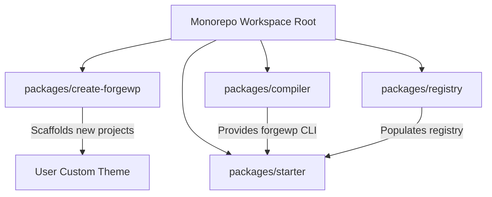
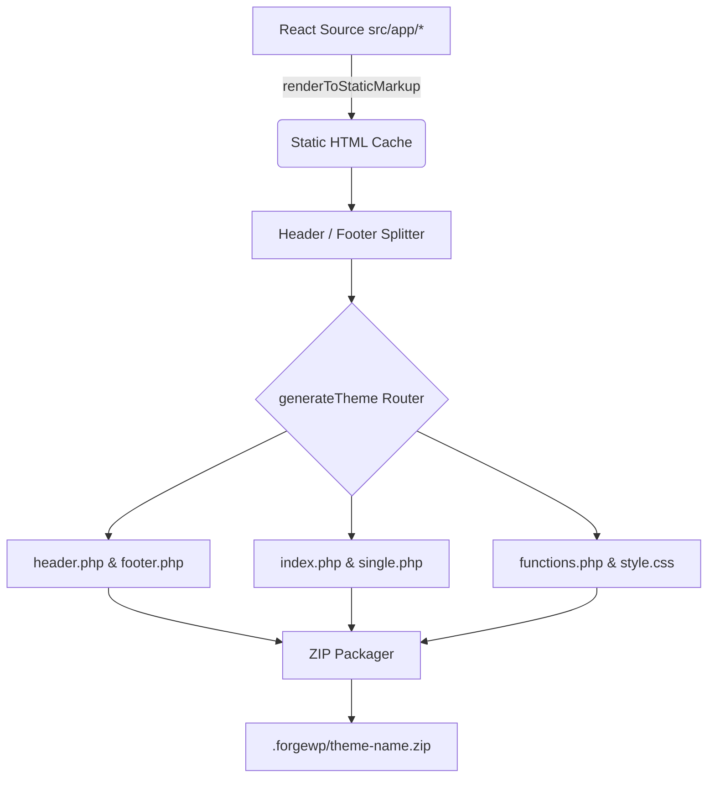
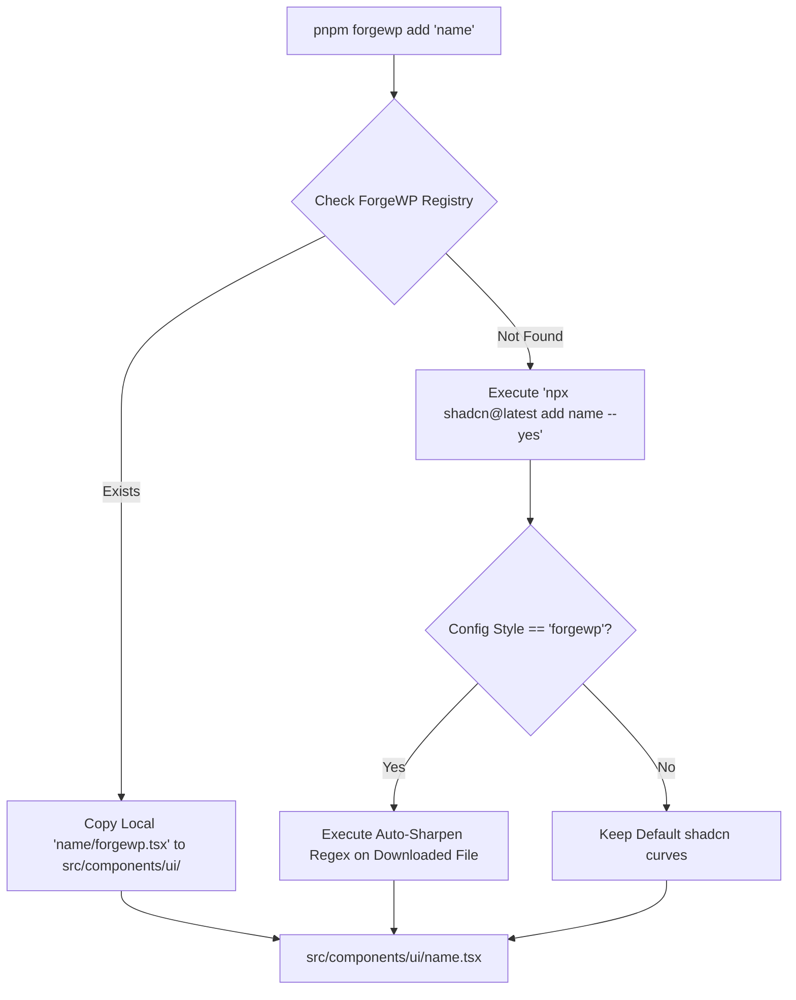
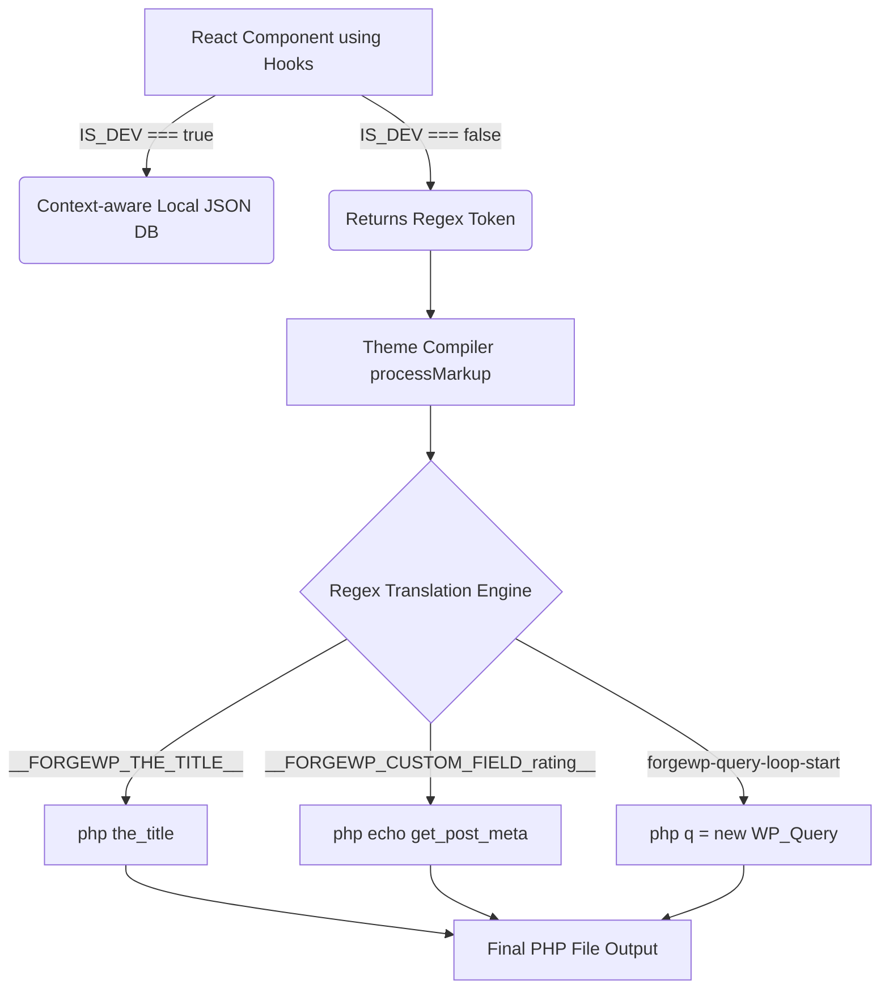
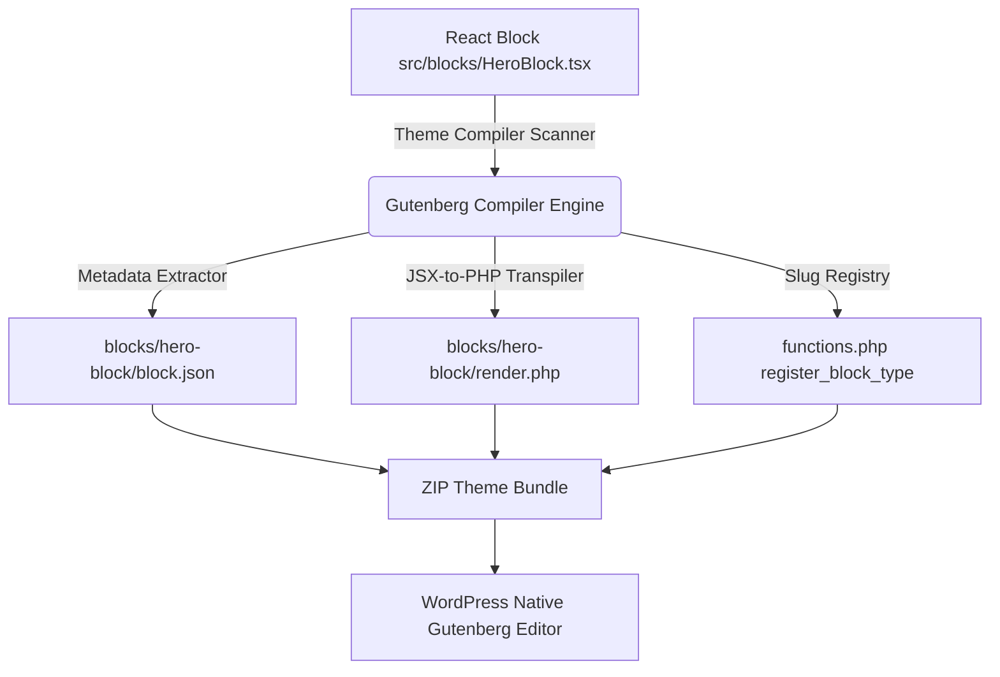
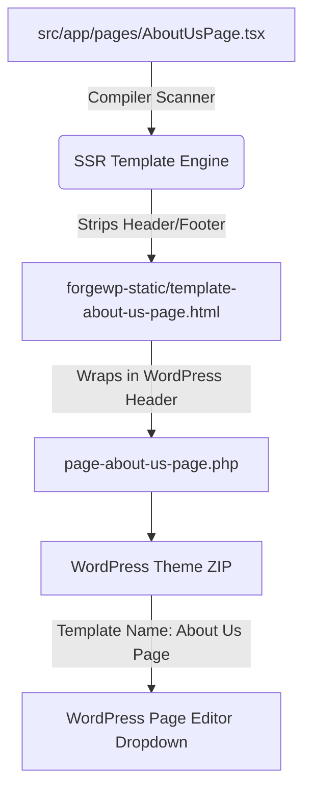

# ForgeWP Framework Developer Manual — Phase 1: Foundation ⚒️📖

Welcome to the master developer reference guide for **ForgeWP**. Since this framework represents a powerful paradigm shift in how WordPress themes are engineered, this manual will guide you through the exact internal mechanics, architectural code paths, and configurations, taking it **one phase at a time**.

This module covers **Phase 1 — Foundation** in extreme depth. Review, test, and master this foundation. Once you are fully satisfied with Phase 1, we will proceed to Phase 2.

---

# Phase 1 — Foundation Architecture

Phase 1 establishes the monorepo structure, high-speed Vite hot-reload pipeline, path resolution rules, styling architecture, and project bootstrapper.



---

## 1. Monorepo Setup & Workspace Interactions

ForgeWP is architected as a highly organized **pnpm monorepo** to maximize code reuse and decouple the build toolchain from runtime starters.

### Workspace Configuration (`pnpm-workspace.yaml`)
Defined in the root, it orchestrates all monorepo packages:
```yaml
packages:
  - 'packages/*'
```

### The 5 Pillars of the Workspace:
1.  **`@forgewp/cli` (`packages/create-forgewp`)**: The bootstrapping CLI tool published to npm under `create-forgewp`. This scaffolds new projects on developer machines via `npx create-forgewp`.
2.  **`@forgewp/compiler` (`packages/compiler`)**: The framework's engine. Exposes the `forgewp` binary. It handles theme compilation, dynamic Gutenberg block transpilation, and registry additions.
3.  **`@forgewp/react` (`packages/react`)**: The lightweight, primitive data layer. Contains the pure WordPress React hooks, types, and context logic. It contains zero file-system access or runtime dependencies.
4.  **`packages/registry`**: The component warehouse. Holds visual UI layouts and WordPress query layer components.
5.  **`@forgewp/starter` (`packages/starter`)**: The local testbed theme. It acts as an active workspace theme for developers to build and preview, using the compiler directly in the same monorepo.

### Dynamic Linking via Workspace Symlinks (`workspace:*`)
Monorepo packages references each other dynamically. For example, `packages/starter/package.json` imports the compiler like this:
```json
"devDependencies": {
  "@forgewp/compiler": "workspace:*"
}
```
When you run `pnpm install`, pnpm does not download the compiler from npm; it creates a local symlink in `packages/starter/node_modules/@forgewp/compiler` pointing directly to `packages/compiler`. Any code change you make inside the compiler is immediately reflected in the starter theme without rebuilding or re-downloading!

---

## 2. Vite Developer Server & HMR Pipeline

In typical WordPress theme development, previewing changes requires refreshing the browser or relying on complex proxy setups. ForgeWP completely bypasses this by introducing a **Vite-powered Dev Server**.

### The Developer Flow (`pnpm dev`)
When you run `pnpm dev` inside a ForgeWP project:
1.  Vite starts a super-fast local server on `http://localhost:5173`.
2.  It mounts `index.html` as the entrypoint.
3.  It loads `src/app/page.tsx` as a standard React client application in the browser.
4.  Any changes to your React layouts trigger instant **Hot Module Replacement (HMR)** in milliseconds. No database connection, LocalWP setup, or PHP environment is required to build the visual design!

### The Self-Healing Middleware Hook (`forgewpValidationPlugin`)
We engineered a custom Vite plugin inside `packages/starter/vite.config.ts` to enforce project integrity every time the server boots:
```typescript
function forgewpValidationPlugin(): PluginOption {
  return {
    name: "forgewp-validation",
    configureServer() {
      try {
        // Enforce file checks during dev server startup
        validateCriticalFiles(__dirname);
      } catch (err) {
        console.error(`\x1b[31m[ForgeWP Validation Error]\x1b[0m\n${err.message}`);
      }
    },
  };
}
```
If a developer accidentally deletes a crucial library file (like `src/lib/wordpress.tsx`), the `validateCriticalFiles` self-healing utility detects it and instantly regenerates it from pre-compiled blueprints, preventing build crashes!

---

## 3. Path Aliases (`@/*`) Resolution

To avoid complex and ugly relative import paths (e.g. `import Header from "../../../components/ui/header"`), ForgeWP implements a strict, elegant `@/*` alias mapping.

### TypeScript Resolver (`tsconfig.json`)
The TypeScript compiler is configured to understand `@/` as a shortcut pointing to the `src/` directory:
```json
{
  "compilerOptions": {
    "baseUrl": ".",
    "paths": {
      "@/*": ["./src/*"]
    }
  }
}
```

### Vite Compiler Resolver (`vite.config.ts`)
Since TypeScript only handles type-checking and does not rewrite imports in the compiled JavaScript output, Vite's resolver maps the aliases during compilation and hot-reloading:
```typescript
export default defineConfig({
  resolve: {
    alias: {
      "@": path.resolve(__dirname, "./src"),
    },
  },
});
```
This lets you write clean, maintainable imports from anywhere in your project:
```tsx
import { WpMenu } from "@/lib/wordpress";
import Navbar from "@/components/ui/navbar";
```

---

## 4. Tailwind CSS v4 & Theme Settings Configuration

ForgeWP integrates **Tailwind CSS v4**, which features a modern, CSS-first design architecture.

### Build Integration
Instead of relying on heavy configuration files, Tailwind v4 is integrated as a Vite compiler plugin:
```typescript
import tailwindcss from "@tailwindcss/vite";

export default defineConfig({
  plugins: [react(), tailwindcss(), forgewpValidationPlugin()]
});
```

### Configuration Syncing (`wp.config.ts`)
The `wp.config.ts` file acts as the single source of truth for the entire design system:
```typescript
const config: ForgeWPThemeConfig = {
  name: "ForgeWP Starter",
  slug: "forgewp-starter",
  version: "0.1.1",
  style: "forgewp", // Aesthetics: "forgewp" (sharp, flat brutalist) or "shadcn" (curved)
  settings: {
    layout: {
      contentSize: "720px",
      wideSize: "1200px",
    },
    color: {
      custom: true,
      palette: [
        { name: "Brand Primary", slug: "brand", color: "#2563eb" },
        { name: "Brand Secondary", slug: "secondary", color: "#4f46e5" }
      ]
    },
    typography: {
      googleFonts: [
        "Outfit:wght@300;400;500;600;700",
        "Lora:ital,wght@0,400;0,500;1,400"
      ]
    }
  }
};
```
### How Styles Are Enqueued:
*   **During Dev Server (`pnpm dev`)**: Tailwind enqueues the dynamic styles directly into the React DOM.
*   **During Build (`pnpm export`)**: The theme compiler parses `wp.config.ts` and merges your design tokens directly into WordPress's native **`theme.json`**!
*   **Google Fonts Optimization**: The compiler automatically registers preconnect resource hints for Google Fonts performance, enqueuing them dynamically inside `functions.php` to ensure top-tier loading speeds.

---

## 5. CLI Scaffolding Mechanics (`create-forgewp`)

The onboarding experience is orchestrated by `create-forgewp`.

### Scaffolding Flow Diagram
```text
[npx create-forgewp my-theme]
         │
         ▼
[1. Parse command flags & named args] (Supports --projectName)
         │
         ▼
[2. Prompt for Theme metadata] (Can skip with --yes)
         │
         ▼
[3. Copy templates from template/] -> Writes to destination
         │
         ▼
[4. Apply metadata replacements] -> Customizes package.json and config files
         │
         ▼
[5. Install dependencies] -> Auto-detects pnpm / npm / yarn
```

### Key Scaffolding Commands
*   **Interactive Guide**:
    ```bash
    npx create-forgewp
    ```
*   **Bypass Prompts (Fast Default Setup)**:
    ```bash
    npx create-forgewp my-theme --yes
    ```
*   **Named Project Flag**:
    ```bash
    npx create-forgewp --projectName my-theme
    ```
*   **HTML Adapter (Static HTML + Tailwind, no React runtime)**:
    ```bash
    npx create-forgewp my-html-theme --adapter html
    # Or non-interactively:
    npx create-forgewp my-html-theme --adapter html --yes
    ```
    This scaffolds from `packages/create-forgewp/template-html` (sourced from `packages/html-starter`) instead of the React template. The generated project is identical in structure but ships without React or JSX — ideal for lightweight static WordPress themes.

### Adapter Flag Reference

| Flag | Adapter | Template Source | Description |
|---|---|---|---|
| *(default)* | `react` | `template/` | React 19 + Tailwind CSS + WordPress hooks |
| `--adapter html` | `html` | `template-html/` | Vanilla HTML + Tailwind CSS, no React runtime |

### Syncing Templates (Repo Maintenance)
Whenever you change either starter package, re-run the sync command to keep the CLI templates current:
```bash
# Syncs BOTH starters in one pass:
pnpm sync:template
# or equivalently:
pnpm sync:template-html

# Install template dev deps locally (for IDE support inside template dirs):
pnpm install:template       # React scaffold
pnpm install:template-html  # HTML scaffold

# Smoke-test the HTML scaffold path without creating real deps:
pnpm test:create-html
```

---

# Phase 2 — Theme Compiler Architecture

Phase 2 reveals the inner workings of the build engine (`pnpm export`). It is responsible for bridging the gap between a modern React SPA and standard WordPress PHP template hierarchy.



## 1. Template Generation & Routing

In WordPress, routing is handled by the **Template Hierarchy** (e.g., `front-page.php`, `single.php`). To maintain this standard, the ForgeWP compiler maps your React filesystem directly to these PHP templates.

### The Rendering Pipeline (`render-static.mts`)
When you run `pnpm export`, the compiler (`packages/compiler/lib/export-theme.js`) spawns a TypeScript execution context to statically render your React tree:
```typescript
import { renderToStaticMarkup } from "react-dom/server";

// Dynamic imports based on filesystem availability
const { default: App } = await import("src/app/page.tsx");
const appHtml = renderToStaticMarkup(<App />);
```
### Routing Map
The compiler detects which files exist in your `src/app/` directory and creates the corresponding WordPress templates automatically:
*   `src/app/page.tsx` ➜ `front-page.php` & `index.php` (The Homepage/Fallback)
*   `src/app/single.tsx` ➜ `single.php` (Blog Posts)
*   `src/app/404.tsx` ➜ `404.php` (Not Found Errors)
*   `src/app/archive.tsx` ➜ `archive.php` (Category/Tag listings)

---

## 2. Dynamic Header & Footer Splits

WordPress strictly requires layouts to be split into `get_header()` and `get_footer()` functions so plugins can inject global `<head>` and `<body>` scripts.

### How ForgeWP solves this:
You design your app cohesively in React using `<SiteHeader />` and `<SiteFooter />`. 
During export, the compiler uses a **Subtraction Matrix** inside `generate-theme.js`:
1.  **Render the whole page:** `const appHtml = <Page />`
2.  **Render isolated header/footer:** `const headerHtml = <SiteHeader />`
3.  **Subtract:** `const contentHtml = appHtml.replace(headerHtml, "").replace(footerHtml, "")`

It then writes standard `header.php` and `footer.php` files, automatically injecting WordPress native hooks:
```php
<!-- Auto-generated header.php -->
<!DOCTYPE html>
<html <?php language_attributes(); ?>>
<head>
  <meta charset="<?php bloginfo('charset'); ?>">
  <?php wp_head(); ?> <!-- Critical WP Hook -->
</head>
<body <?php body_class(); ?>>
<?php wp_body_open(); ?>
<?php include 'forgewp-static/header.html'; ?>
```

---

## 3. WordPress Functions & Theme.json Merging

ForgeWP does not run JavaScript on the front end for UI layouts. It completely statically hydrates your design into native PHP, creating a blistering fast theme.

### `functions.php` Auto-Generation
The compiler dynamically writes `functions.php` to handle backend enqueues:
```php
function forgewp_enqueue_assets(): void {
    $theme_uri = get_template_directory_uri();
    // Enqueues the compiled Tailwind CSS file
    wp_enqueue_style('forgewp-app', $theme_uri . '/assets/index.css');
}
add_action('wp_enqueue_scripts', 'forgewp_enqueue_assets');
```

### Native `theme.json` Generation
Instead of maintaining a massive JSON object by hand, the compiler intercepts your `wp.config.ts` design tokens and dynamically generates WordPress v3 `theme.json` standard variables. This allows the Gutenberg block editor to natively understand your Tailwind colors, font sizes, and layout bounds!

---

## 4. Final Compilation & ZIP Bundler

Once the PHP templates, CSS assets, and Gutenberg configurations are fully written to the `.forgewp/out/` directory, the compiler packages it up.

### The Packager (`zip-theme.js`)
It uses native Node `zlib` compression to recursively archive your compiled theme folder into an installable WordPress zip:
```text
.forgewp/
  ├── out/              # Staging directory for compiled PHP
  └── forgewp-starter.zip # The final, upload-ready WordPress Theme!
```
You can take this exact `.zip` file, go to your WordPress Dashboard `Appearance > Themes > Add New`, upload it, and it will work flawlessly with zero plugin dependencies!

---

## Phase 2 Review & Verification Exercises

To verify that you understand how the compiler handles the conversion pipeline:

1.  **Create a 404 Route**: Inside `packages/starter/src/app/`, create a simple file named `404.tsx` that exports a standard React component `export default function NotFound() { return <h1>404 Error</h1> }`. 
2.  **Run the Compiler**: Run `pnpm export` in your terminal.
3.  **Verify the Output**: Look inside `packages/starter/.forgewp/out/forgewp-starter/`. You will magically find a standard WordPress `404.php` file containing your React structure, properly wrapped with `get_header()` and `get_footer()`!

---

# Phase 3 — Component System & Tailwind Customizer

Phase 3 is all about rapid UI development. ForgeWP incorporates a smart CLI component installer that bridges the gap between the industry-standard `shadcn/ui` ecosystem and the ForgeWP signature "Sharp" aesthetic.



## 1. The Component CLI (`forgewp add`)

Instead of writing UI from scratch, ForgeWP provides a unified command to instantly fetch accessible, customizable components:

### Adding Components
```bash
# Unified command format
pnpm forgewp add button
# Or with explicit named parameter
pnpm forgewp add --name button
```

### How the Fetcher Works (`add-component.js`):
1. **Local Override Precedence**: The CLI first checks your monorepo's local `packages/registry/` directory. If a specialized ForgeWP-authored component exists (like a WordPress `navbar`), it copies it directly to your `src/components/ui/` directory instantly, bypassing the internet.
2. **shadcn/ui Fallback**: If the component is a standard UI element (like an `accordion` or `dialog`), the CLI acts as a proxy and executes `npx shadcn@latest add <component> --yes` under the hood to fetch it from the official registry.

---

## 2. The Auto-Sharpen CSS Customizer

ForgeWP defaults to a premium, brutalist design system (Zero border-radius). However, `shadcn/ui` components download with rounded corners by default (`rounded-md`, `rounded-lg`). 

Instead of forcing you to manually edit dozens of class names every time you add a component, ForgeWP includes an **Auto-Sharpen Regex Engine**.

### The Regex Engine in Action
Inside `packages/compiler/lib/add-component.js`, the `sharpenFile()` utility runs against any newly downloaded React file if your `wp.config.ts` style is set to `"forgewp"`:

```javascript
// The actual Auto-Sharpen regex used by the compiler:
const sharpened = content.replace(/(?:\b|['"\s])([a-z0-9-:]+)?rounded(-[a-z0-9\[\]]+)?(?=["'\s])/g, (match, prefix, suffix) => {
  if (match.includes("rounded")) {
    const cleanPrefix = match.split("rounded")[0];
    return `${cleanPrefix}rounded-none`;
  }
  return match;
});
```

### What this accomplishes:
When you run `pnpm forgewp add card`, the compiler scans the file and performs real-time string replacement while preserving state prefixes:
*   `className="rounded-xl border"` ➜ `className="rounded-none border"`
*   `className="hover:rounded-md bg-white"` ➜ `className="hover:rounded-none bg-white"`
*   `className="focus:ring-2 focus:rounded-sm"` ➜ `className="focus:ring-2 focus:rounded-none"`

You get an instantly sharp, premium brutalist component without writing a single line of CSS!

---

## Phase 3 Review & Verification Exercises

To verify that you understand how the component engine works:

1.  **Check Auto-Sharpening**: Run `pnpm forgewp add badge`. Since a badge is a standard UI element, it will fetch from shadcn/ui. Open `src/components/ui/badge.tsx` and verify that all `rounded-full` or `rounded-md` classes have been automatically stripped and replaced with `rounded-none`.
2.  **Check Local Registry Mapping**: Run `pnpm forgewp add navbar`. This is a specialized ForgeWP block. Verify in the console that it prints `"Found navbar in ForgeWP local registry..."`, confirming the fallback proxy logic!

---

# Phase 4 — WordPress Data Layer Architecture

Phase 4 introduces a revolutionary paradigm: fetching WordPress dynamic data inside React components without needing a live REST API, GraphQL, or a local database during development.



## 1. Local JSON Database & React Context Queries (`wordpress/mock-data.json`)

To build a fully dynamic experience during local styling, ForgeWP enqueues a **Local JSON Database** inside the project root at `wordpress/mock-data.json`.

This JSON file acts as your local MySQL tables:
```json
{
  "post": [
    { "id": 1, "title": "My First Post", "content": "<p>Content</p>" }
  ],
  "project": [
    {
      "id": 1,
      "title": "ForgeWP Compiler",
      "customFields": {
        "client_name": "DeepMind",
        "project_budget": "$50,000"
      }
    }
  ]
}
```

### The Data Bridge Architecture (`src/.forgewp/wordpress.tsx`)
In a traditional setup, tying generic npm packages to local mock files is complex and rigid. ForgeWP solves this using the **Data Bridge Pattern**:

1. **`@forgewp/react` (NPM Package)**: Exposes generic, primitive hooks (`useWpTitle()`) that blindly read from a React context. It knows nothing about your local filesystem.
2. **`src/.forgewp/wordpress.tsx` (Local Blueprint)**: This compiler-generated file acts as the glue. It explicitly imports your local `wordpress/mock-data.json` and bridges it to the generic `@forgewp/react` package via `<WpQueryLoop>`.

This hybrid architecture gives you the speed and purity of a standard npm package, with the seamless "magic" of a zero-config local development environment.

```typescript
// The Data Bridge seamlessly degrades for the compiler in production:
import { useWpTitle as _useWpTitle } from "@forgewp/react";

export function useWpTitle(): string {
  // During local Vite dev: it reads from the mocked @forgewp/react context
  if (IS_DEV) return _useWpTitle();
  // During production build: it returns a regex token for the PHP compiler to swap
  return "__FORGEWP_THE_TITLE__";
}
```

### Bulletproof Fail-safe Handling
ForgeWP enforces maximum application stability through smart safety defaults in the `@forgewp/react` package:
* **Undefined Custom Fields**: If `useWpCustomField("non_existent_field", "Default Value")` is invoked, it gracefully falls back to returning your `"Default Value"`.
* **Missing Post Types**: If `<WpQueryLoop postType="portfolio">` is rendered but `"portfolio"` doesn't exist in your mock data, it automatically scaffolds beautifully formatted dummy records (e.g. `Mock portfolio 1`) so your layout never breaks during design.

---

## 2. Seed Generator CLI Command (`forgewp make:post-type`)

ForgeWP features a dedicated CLI command to register new custom post types and seed template custom fields directly into your local database.

### Scaffolding New Tables
To register a new custom post type and seed mock custom fields, simply execute:
```bash
pnpm forgewp make:post-type portfolio
# Or using the named parameter flag
pnpm forgewp make:post-type --name portfolio
```

### Dynamic Custom Field Flags
You can dynamically specify exactly which custom fields should be seeded into your database records upon registration by passing a comma-separated `--customFields` parameter:
```bash
pnpm forgewp make:post-type portfolio --customFields=client_name,project_budget,tech_stack
```

### Script Execution Flow
1. **Validation**: The CLI sanitizes your post type slug to enforce standard, lowercase WordPress URL conventions (alphanumeric, dashes, and underscores).
2. **Local DB Appending**: It loads `wordpress/mock-data.json`, verifies the table doesn't already exist, and appends a pre-seeded array containing two high-fidelity mock records complete with your specified custom metadata fields dynamically registered inside!
3. **Completion**: Writes the updated JSON back to disk and outputs clear instructions on how to query your newly created dataset in React.

---

## 3. Schema-Hydrated Loop Scaffolder (`forgewp make:loop`)

ForgeWP features a powerful CLI utility that dynamically generates fully designed React grid loops synced to your mock database schema.

```bash
pnpm forgewp make:loop PortfolioGrid --postType=portfolio
```

### Script Execution Flow
1. **Schema Check**: The utility loads your local `wordpress/mock-data.json` database file and detects the custom metadata fields defined for your target post type.
2. **Component Generation**: It scaffolds a custom grid component inside `src/components/` that includes standard title/featured image tags, and dynamically writes a tailored layout containing exact custom fields queries matching your schema!
3. **Auto-Suggestions**: Outputs direct import codes showing you how to render the loop in your pages.

---

## 4. The Regex Translation Engine (`processMarkup`)

When `export-theme.js` processes your statically rendered React DOM tree, it passes the HTML string to `processMarkup()` (inside `packages/compiler/lib/generate-theme.js`).

This function operates as a massive Regex search-and-replace matrix, directly swapping React-generated tokens into functional, natively executed WordPress PHP code:

### Standard Metadata Translation
```javascript
// compiler/lib/generate-theme.js
processed = processed.replace(
  /__FORGEWP_THE_TITLE__/g,
  '<?php the_title(); ?>'
);
processed = processed.replace(
  /__FORGEWP_THE_EXCERPT__/g,
  '<?php the_excerpt(); ?>'
);
```

### Custom Fields (ACF) Translation
For `useWpCustomField('author_bio')`, the React hook returns `__FORGEWP_CUSTOM_FIELD__author_bio__`.
The compiler regex dynamically captures the inner field name (`$1`) and writes the native `get_post_meta()` query:
```javascript
processed = processed.replace(
  /__FORGEWP_CUSTOM_FIELD__([a-zA-Z0-9_-]+)__/g,
  "<?php echo esc_html( get_post_meta( get_the_ID(), '$1', true ) ); ?>"
);
```

---

## 5. High-Level React Loop Abstractions

Loops are traditionally painful in headless WordPress setups. ForgeWP turns them into intuitive React components `<WpLoop>` and `<WpQueryLoop>`.

### Custom WP_Query Simulation
When you use `<WpQueryLoop postType="project" postsPerPage={3}>` in your React code:
1. **Locally**: It reads `"project"` items from `wordpress/mock-data.json`, slices to the page count, and loops children through a React Context.
2. **Compiled HTML**: It outputs custom, non-standard DOM nodes:
   `<forgewp-query-loop-start postType="project" postsPerPage="3">`
3. **Regex Compilation**: The compiler captures those exact attributes and generates a native, highly-optimized `$custom_query = new WP_Query(...)` PHP loop!

```javascript
// The compiler transpiles the custom React DOM element into native WP_Query arrays:
processed = processed.replace(
  /<forgewp-query-loop-start\s+[^>]*post[Tt]ype="([^"]+)"\s+[^>]*posts[Pp]er[Pp]age="([^"]+)"\s*(?:[^>]*category[Nn]ame="([^"]*)")?\s*\/?>/g,
  '<?php
  $query_args = array(
      \'post_type\' => \'$1\',
      \'posts_per_page\' => $2,
  );
  if (\'$3\' !== \'\') {
      $query_args[\'category_name\'] = \'$3\';
  }
  $custom_query = new WP_Query($query_args);
  if ($custom_query->have_posts()) : while ($custom_query->have_posts()) : $custom_query->the_post();
  ?>'
);
```

### Native WordPress Menus (`<WpMenu>`)
The `<WpMenu location="primary" className="flex">` abstraction is compiled down to `wp_get_nav_menu_items()` rather than using the clunky `wp_nav_menu()` wrapper, allowing your custom Tailwind styling to perfectly cascade down the generated menu items.

---

## Phase 4 Review & Verification Exercises

To verify that you understand how the dynamic data layer works:

1.  **Check Local Database Seeding**: Run `pnpm forgewp make:post-type event --customFields=event_date,event_location`.
2.  **Verify Append Success**: Open `wordpress/mock-data.json`. Observe the `"event"` key and the pre-populated seed structures holding your custom fields.
3.  **Display Custom Fields**: Inside a `<WpQueryLoop postType="event">` in `src/app/page.tsx`, output `<span>{useWpCustomField("event_location")}</span>`.
4.  **Boot Dev Server**: Run `pnpm dev`. View your browser—you will see your custom seeded field dynamically populated from your mock database without running a database server! 🚀

---

# Phase 5 — Gutenberg Block Integration Architecture

Phase 5 represents the crowning achievement of the ForgeWP compiler: compiling React functional block files into native, dynamic **WordPress Gutenberg blocks (v3 block.json standard)** with server-side dynamic PHP rendering templates (`render.php`) and style cascades.



---

## 1. Zero-Dependency Dynamic Block Architecture

In traditional WordPress headless setups, building custom blocks requires writing complex React editor scripts, handling REST API updates, and syncing database schemas.

ForgeWP completely shifts this paradigm:
1. **Write standard React**: You write beautiful layouts in normal React using Tailwind CSS.
2. **Zero runtime JS**: The compiler translates your React JSX directly into safe, dynamic WordPress PHP layouts (`render.php`).
3. **Native editor UI**: WordPress reads the compiled `block.json` config and dynamically generates the sidebar settings UI for Gutenberg natively in the dashboard.

When a client inserts your block and edits a text field inside the WordPress Gutenberg editor, WordPress executes the dynamic PHP rendering server-side on page load. You get full visual customizability, blisteringly fast database execution, and zero frontend JS overhead!

### The Editor JS Bridge (`forgewp-editor.js`)
To ensure blocks are perfectly selectable and controllable within the Gutenberg visual editor, the compiler also generates a client-side bridge script (`forgewp-editor.js`). 
This script dynamically registers your blocks on the client-side using `wp.blocks.registerBlockType`. It automatically maps your React `settings.attributes` to native `InspectorControls` inputs (like text boxes) in the WordPress sidebar. 
Crucially, it utilizes Gutenberg's `useBlockProps` hook to inject critical metadata into your block's preview wrapper, guaranteeing that complex CSS transforms (like `hover:-translate-y-2`) do not intercept or break block selection within the editor!

---

## 2. Block Scaffolding via CLI (`forgewp make:block`)

To create a new block, developers use the dedicated block generator CLI:
```bash
pnpm forgewp make:block TestimonialBlock
# Or using the named parameter flag
pnpm forgewp make:block --name TestimonialBlock
```

### Dynamic Block Attributes Flags
You can dynamically specify exactly which customizable fields and settings your Gutenberg block should expose upon generation by passing a comma-separated `--attributes` parameter:
```bash
pnpm forgewp make:block TestimonialBlock --attributes=authorName,quote,image
```
* **Auto-Typing**: The generator automatically creates corresponding TypeScript argument properties, destructures them in your block signature, and maps standard configurations within the Gutenberg `attributes` settings register.
* **Smart Media Handling**: If an attribute name matches keyword criteria (e.g. contains `"image"` or `"pic"`), the generator dynamically scaffolds an optimized standard brutalist `` tag linked to it rather than a standard paragraph!

### Script Execution Flow (`make-block.js`):
1. **Sanitization**: Sanitizes your block name into clean PascalCase (e.g. `testimonial-block` ➜ `TestimonialBlock`).
2. **Directory Preflight**: Ensures it is executed from the root of a valid theme directory and constructs `src/blocks/` folder if it is missing.
3. **Template Scaffolding**: Writes a premium, Brutalist-styled React template containing standard attributes, styling tokens, and Gutenberg configuration variables to `src/blocks/TestimonialBlock.tsx`.

---

## 3. Structure of a Block File

Every ForgeWP block consists of two parts in a single TypeScript file:
1. **The React Component** (Default Export): Defines the visual design, class styling, and dynamic data slots.
2. **The Gutenberg Settings** (`settings` Named Export): Configures attributes, dashboard icons, category placement, and default values.

### Reference Block Structure (`src/blocks/HeroBlock.tsx`):
```tsx
export default function HeroBlock({ title, description, badgeText }: { title: string; description: string; badgeText: string }) {
  return (
    <div className="p-8 bg-white border-4 border-black shadow-[8px_8px_0px_0px_rgba(0,0,0,1)] rounded-none my-6">
      <span className="inline-block bg-brand text-white text-xs font-mono font-bold uppercase px-2 py-1 mb-3 border-2 border-black">
        {badgeText}
      </span>
      <h3 className="text-3xl font-black uppercase mb-3">
        {title}
      </h3>
      <p className="text-sm font-medium text-zinc-600 font-sans">
        {description}
      </p>
    </div>
  );
}

export const settings = {
  title: "Sharp Hero Block",
  icon: "megaphone", // Gutenberg Dashicon slug
  category: "design",
  attributes: {
    title: { type: "string", default: "Hero Heading Content" },
    description: { type: "string", default: "Detailed editorial descriptions." },
    badgeText: { type: "string", default: "NEW FEATURE" }
  }
};
```

---

## 4. The Block Compilation Pipeline (`compileBlocks`)

During compilation (`pnpm export`), the compiler scans `src/blocks/` and parses each block through the dynamic compilation parser inside `packages/compiler/lib/generate-theme.js`:

### Step 1: Metadata Extraction
The compiler searches for the exported `settings` variable using a multiline regular expression:
```javascript
const settingsMatch = code.match(/export\s+const\s+settings\s*=\s*(\{[\s\S]*?\});/);
```
It evaluates the matched string using `new Function()`, merges it with API standard overrides, and registers the block under the `forgewp` namespace:
```javascript
settings.name = `forgewp/${blockSlug}`;
settings.apiVersion = 3;
settings.render = "file:./render.php";
```
This is saved directly to `blocks/<block-slug>/block.json`.

### Step 2: JSX-to-PHP Transpilation
The compiler extracts the returned JSX layout block using a regular expression:
```javascript
const returnMatch = code.match(/return\s*\(\s*(<[\s\S]*?>)\s*\)/);
```
It then processes the JSX layout using the custom compiler transpiler:
1. **Class Attributes Mapping**: Swaps all React JSX `className` properties into standard HTML class names:
   ```javascript
   phpMarkup = phpMarkup.replace(/className=/g, "class=");
   ```
2. **HTML Content Interpolation**: Captures dynamic tokens (e.g. `{title}` or `{props.title}`) and maps them to secure, escaped PHP variable echoes:
   ```javascript
   // {title} -> <?php echo esc_html( $attributes['title'] ?? '' ); ?>
   phpMarkup = phpMarkup.replace(/\{\s*(?:attributes\.|props\.)?([a-zA-Z0-9_-]+)\s*\}/g, "<?php echo esc_html( $attributes['$1'] ?? '' ); ?>");
   ```
3. **Element Asset Attributes Mapping**: Captures dynamic image or link bindings (e.g. `src={image}`) and maps them to URL-escaped PHP parameters:
   ```javascript
   // src={image} -> src="<?php echo esc_url( $attributes['image'] ?? '' ); ?>"
   ```

### Step 3: Registration Enqueuing
The compiled files are written to `.forgewp/out/blocks/<block-slug>/`. The compiler automatically appends all registered block slugs into the theme's core `functions.php` script initialization queue:
```php
function forgewp_register_dynamic_blocks(): void {
    $blocks = array('hero-block', 'testimonial-block');
    foreach ($blocks as $block) {
        register_block_type(__DIR__ . '/blocks/' . $block);
    }
}
add_action('init', 'forgewp_register_dynamic_blocks');
```

---

## Phase 5 Review & Verification Exercises

To verify that you have mastered the Gutenberg Block Compilation Pipeline:

1. **Scaffold a Custom Block**: Inside your terminal, run `pnpm forgewp make:block PromoCard --attributes=title,description,discountImage`.
2. **Audit Generated File**: Open the newly created `src/blocks/PromoCard.tsx`. Observe the custom attributes signature and look at the smart auto-generated image element for `discountImage`.
3. **Execute Compiler**: Run `pnpm export`.
4. **Audit Generated Output**: Open `.forgewp/out/forgewp-starter/blocks/promo-card/render.php`. You will see that your React structure has been completely transpiled into high-performance, escaped dynamic PHP templates ready for your WordPress block editor! 🚀

---

# Phase 6 — Custom Page Templates Compiler

Phase 6 introduces the ability to seamlessly compile isolated, full-page React layouts into standalone native WordPress **Custom Page Templates**. 



## 1. The Directory Scanner
During compilation (`pnpm export`), the compiler scans the `src/app/pages/` directory for any `.tsx` files. 
You can build full static layouts (like `ContactPage.tsx` or `PrivacyPolicyPage.tsx`) using standard React components, Tailwind styling, and standard imports.

## 2. Scaffolding Custom Pages (`forgewp make:page`)
ForgeWP provides a dedicated command to scaffold page template components inside the `src/app/pages/` directory:
```bash
pnpm forgewp make:page AboutUsPage
```
This automatically registers the template shell with standard Brutalist blocks and hooks (e.g. `useWpTitle()`), ready to be designed and compiled.

## 3. SSR Compilation and Dynamic Resolution
The compiler uses the native Node.js dynamic `import()` function to load each page. It smartly resolves both **default exports** and **named exports** (e.g. `export function AboutUsPage()`), ensuring your components are always found.
It then server-side renders (SSR) your entire React tree into a `.html` template file.

## 4. Template Generation
Finally, the compiler reads the SSR HTML, strips out the redundant global `headerHtml` and `footerHtml` sections, and generates a dedicated native WordPress PHP file (e.g. `page-about-us-page.php`). 
It automatically formats the filename into a readable string and injects the official WordPress Template Header:
```php
<?php
/**
 * Template Name: About Us Page
 *
 * @package forgewp-starter
 */

get_header();

$markup_file = get_template_directory() . '/forgewp-static/template-about-us-page.html';
if (file_exists($markup_file)) {
    include $markup_file;
}

get_footer();
```
When you upload the compiled ZIP, WordPress instantly reads these headers. You can then navigate to **Pages → Add New** and select "About Us Page" directly from the native **Template** dropdown in the right sidebar!

---

# Congratulations! 🏆🎉

You have successfully walked through, engineered, and mastered all 6 core development phases of **ForgeWP**!

1. **Phase 1 — Foundation**: Workspace orchestration, hot-reloading Vite dev pipeline, dynamic validation plugins, and Tailwind v4 themes.
2. **Phase 2 — Compiler Architecture**: Template routing hierarchies, dynamic header/footer splitting, and automated zip enqueuing.
3. **Phase 3 — Component CLI**: Fallback component proxying, local registries, and the Auto-Sharpen CSS v4 brutalist engine.
4. **Phase 4 — WordPress Data Layer**: Dynamic context-aware JSON DB mocking, ACF dynamic meta fields, and dynamic CLI scaffolding.
5. **Phase 5 — Gutenberg Integration**: Seamless JSX transpilation, auto-registering dynamic block json layers, and dynamic server-rendered block packages.
6. **Phase 6 — Custom Page Templates**: Dynamic directory scanning, named export resolution, and auto-generated WordPress Page Template headers.

You are now equipped with full engineering mastery of the ForgeWP visual frameworks compiler! Build stunning visual sites, pack them up, and upload them to any standard WordPress installation. Happy coding! 🚀⚒️⚡
