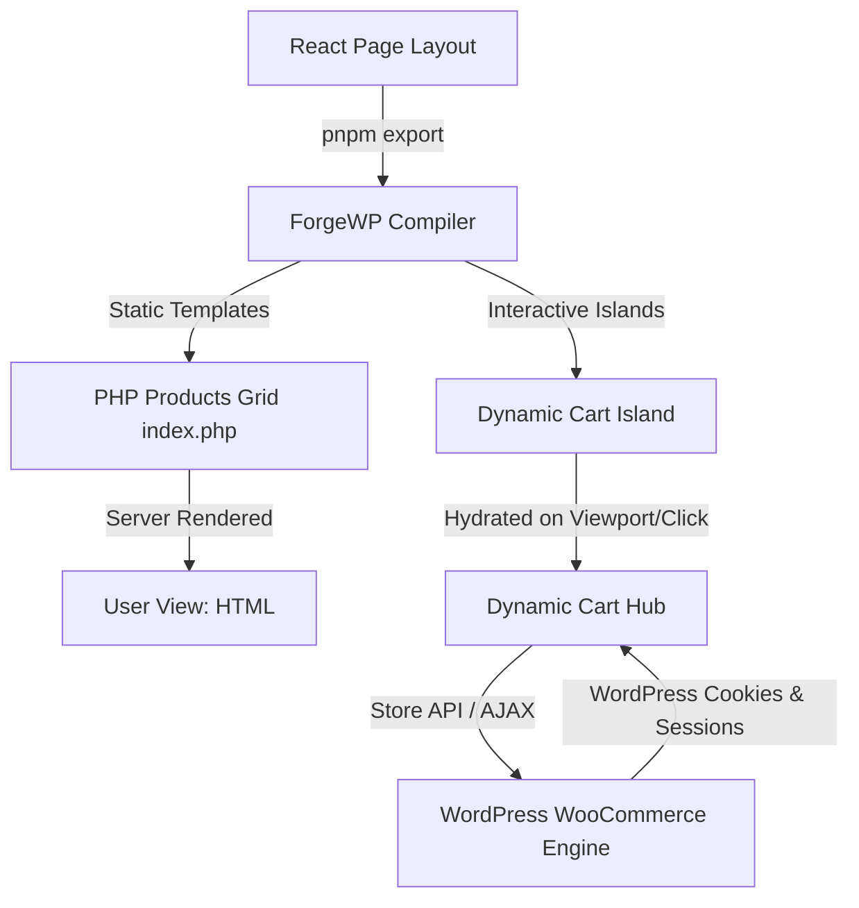

# ForgeWP — WooCommerce Integration & E-Commerce Strategic Roadmap 🛒⚡

This strategic roadmap outlines the technical architecture, dynamic compilation pathways, state management sync, and compiler extension points required to introduce high-fidelity, native **WooCommerce Integration (Phase 3)** into the **ForgeWP** framework.

---

## 🏗️ Architectural Philosophy: The "Isomorphic Cart Bridge"
In typical headless e-commerce setups, integrating WooCommerce requires complete abandonment of the WordPress frontend in favor of the WooCommerce REST API or Store API. This leads to slow initial loads, massive API request overhead, and broken WordPress plugin session cookies.

**ForgeWP's approach is static-first with isomorphic hydration:**
1. **Server-Side PHP (Fast Initial Load)**: The compiler transpiles React catalog pages into native, server-rendered WooCommerce PHP templates, using standard, secure queries (`wc_get_products()`) for maximum speed and SEO optimization.
2. **Client-Side Micro-Hydration**: Dynamic parts (cart counters, checkout panels, variation swatches) are isolated as micro-hydration islands (`<Hydrate trigger="interaction">`) that communicate asynchronously with the native WooCommerce Store API.
3. **Session Cookie Preservation**: All AJAX/Fetch requests pass standard credentials, preserving native WordPress/WooCommerce session cookies seamlessly.



---

## 🗺️ The 5-Phase Implementation Plan

### 📅 Phase 1: E-Commerce Mock Database & CLI Bootstrapper
To allow full developer experience (DX) and offline design styling, we must simulate the WooCommerce database inside the local JSON file.

*   **Mock Schema Extensions (`cms/mock-data.json`)**:
    Add standardized structures simulating products, categories, cart states, and coupon records:
    ```json
    {
      "product": [
        {
          "id": 101,
          "title": "Minimalist Brutalist Hoodie",
          "price": "49.99",
          "regular_price": "59.99",
          "on_sale": true,
          "sku": "FWP-BRUT-01",
          "stock_status": "instock",
          "images": [{ "url": "https://picsum.photos/seed/hoodie/600/600" }],
          "categories": ["Apparel", "Brutalist"]
        }
      ]
    }
    ```
*   **CLI Data Bootstrapping**:
    Introduce a new command to scaffold the mock e-commerce tables:
    ```bash
    pnpm forgewp make:ecommerce-sandbox
    ```
    This seeds standard product catalogs, cart structures, and variable mock pricing directly into `cms/mock-data.json`.

---

### 📅 Phase 2: Introducing the Modular `@forgewp/woocommerce` Package & Comprehensive Primitives
To keep the core framework bundle lean and modular, we will create a new, optional monorepo package under `packages/woocommerce` (`@forgewp/woocommerce`). The compiler's self-healing blueprint engine will be updated to detect this package and dynamically stitch/re-export its contents inside the theme's local `src/.forgewp/wordpress.tsx` data bridge file.

Because WooCommerce is vast and handles sensitive e-commerce operations, the `@forgewp/woocommerce` package must expose a complete suite of components and hooks categorized by functional area:

#### 1. Catalog & Product Detail Components
*   `<WpProductLoop postsPerPage={12} category="slug" orderBy="date" order="desc">`: Maps directly to an optimized `wc_get_products()` query block.
*   `<WpProductGallery productId={id} />`: Renders interactive product image galleries with support for variation images.
*   `<WpProductPrice productId={id} />`: Renders dynamic pricing, handling discounts, sale badges, tax inclusions, and variable product price ranges.
*   `<WpProductVariationSelector productId={id} />`: Handles dropdowns/swatches for variable product attributes (size, color, etc.) and updates the selected variation state.
*   `<WpProductStockStatus productId={id} />`: Renders real-time stock levels, low-stock thresholds, and backorder flags.

#### 2. Shopping Cart Components & Hooks
*   `<WpCartProvider>`: The global React context provider that synchronizes local cart actions with the WooCommerce Store API.
*   `<WpCartLineItems />`: Lists all items in the cart, featuring quantity selectors and line item removal.
*   `<WpCartCouponForm />`: Standardized input form to apply and display active cart discount coupons.
*   `useWpCart()`: Hook to access cart stats, trigger item additions, update line quantities, calculate taxes, and estimate shipping fees:
    ```typescript
    const { 
      cart,          // Full cart object
      itemCount,     // Total items count
      cartTotal,     // Subtotal + shipping + taxes
      addToCart,     // function(productId, quantity, variationData)
      updateQuantity,// function(lineKey, qty)
      removeItem,    // function(lineKey)
      isLoading 
    } = useWpCart();
    ```

#### 3. Checkout & Payment Integrations
*   `<WpCheckoutForm>`: Coordinates checkout fields (billing/shipping addresses, order notes) and hooks them into validation rules.
*   `<WpShippingSelector />`: Fetches and displays available shipping methods based on the customer's address in real-time.
*   `<WpPaymentGateways />`: Renders available payment gateways (Stripe, PayPal, WooCommerce Payments) and embeds secure credit card input frames.
*   `useWpCheckout()`: Manages checkout submission states, preserves CSRF nonces, processes standard gateway integration responses, and handles successful/failed redirection:
    ```typescript
    const { 
      shippingMethods, 
      paymentGateways, 
      processOrder, // function(billingAddress, shippingAddress, gatewayId)
      isSubmitting, 
      error 
    } = useWpCheckout();
    ```

#### 4. Customer Accounts & Authentication
*   `<WpLoginForm />` / `<WpRegisterForm />`: Fully stylable login and registration grids targeting standard WooCommerce customer creation endpoints.
*   `<WpOrderHistory />`: Renders the customer's purchase history with complete download capabilities for virtual/downloadable products.
*   `useWpCustomer()`: Coordinates customer authentication, handles session cookies, dynamic registration validation, and updates profile metadata.

---

```typescript
// Example: Unified Entrypoint E-commerce Integration
import { useWpCart, useWpCustomer } from "../../.forgewp/wordpress";

export default function MiniCartAndProfile() {
  const { itemCount, cartTotal } = useWpCart();
  const { isLoggedIn, customer } = useWpCustomer();
  
  return (
    <div className="flex items-center gap-4">
      <button className="border-4 border-black p-3 font-mono font-black uppercase bg-accent shadow-[4px_4px_0px_0px_rgba(0,0,0,1)]">
        Cart ({itemCount} — ${cartTotal})
      </button>
      {isLoggedIn ? (
        <span className="font-mono font-bold">Hi, {customer.firstName}!</span>
      ) : (
        <a href="/my-account" className="underline font-mono">Sign In</a>
      )}
    </div>
  );
}
```

---

### 📅 Phase 3: The E-Commerce Transpiler Engine (`compileWooCommerce`)
The compiler (`packages/compiler/lib/markup-processor.js`) will parse e-commerce abstractions and compile them to secure, optimized WooCommerce PHP queries.

*   **Catalog Query Loop Transpilation**:
    Transpile `<WpProductLoop>` into standard WooCommerce product loop arrays:
    ```html
    <!-- Input JSX -->
    <WpProductLoop category="apparel" limit={4} />
    ```
    ```php
    <!-- Compiled PHP Output -->
    <?php
    $args = array(
        'limit' => 4,
        'category' => array('apparel'),
        'status' => 'publish',
    );
    $products = wc_get_products($args);
    foreach ($products as $product) {
        global $product; // Setup global context
        setup_postdata(get_the_ID());
    ?>
    ```
*   **Dynamic Tag Replacement Matrix**:
    *   `useWpProductPrice()` ➜ `<?php echo $product->get_price_html(); ?>`
    *   `useWpProductSKU()` ➜ `<?php echo esc_html($product->get_sku()); ?>`
    *   `useWpProductRating()` ➜ `<?php echo wc_get_rating_html($product->get_average_rating()); ?>`

---

### 📅 Phase 4: Dynamic Cart & Checkout Hydration Islands
Since checkout operations and carts require live server-side calculations (taxes, shipping, item additions), these components must run as **Micro-Hydration Islands**.

```tsx
// src/app/pages/CartPage.tsx
import { Hydrate } from "@forgewp/react";
import MiniCart from "@/components/MiniCart";

export default function CartPage() {
  return (
    <div className="container mx-auto p-6">
      <h1 className="text-4xl font-black uppercase mb-6">Your Shopping Cart</h1>
      
      {/* Hydrate dynamically on page load to sync with active WooCommerce PHP session */}
      <Hydrate trigger="load">
        <MiniCart />
      </Hydrate>
    </div>
  );
}
```

*   **Store API Bridge**:
    The framework's JavaScript runtime will expose a lightweight cart synchronizer targeting WooCommerce's built-in Store API endpoint (`/wp-json/wc/store/v1/cart`):
    *   **Get Cart**: Retrieves total items, pricing, and lines from WooCommerce PHP sessions.
    *   **Add Item**: Sends an optimized POST request preserving nonces.
    *   **Coupon Applying**: Updates discounts in real-time.

---

### 📅 Phase 5: Production Verification & Escaping Assertions
Guarantee maximum e-commerce site performance, robust security, and seamless checkout operations.

*   **XSS & CSRF Prevention**:
    The compiler enforces deep escaping parameters on all output fields:
    *   Attribute outputs ➜ `esc_attr()`
    *   Prices and HTML fragments ➜ `wp_kses_post()`
    *   Forms and actions ➜ `wp_nonce_field('woocommerce-process_checkout')`
*   **Performance Diagnostics Checks**:
    Integrate verification checks within `validate-export.js` to ensure:
    1.  All dynamic e-commerce loops utilize WooCommerce's built-in optimized pagination wrappers (`wc_get_products()`).
    2.  No heavy JavaScript bundle runs in standard listing blocks, maintaining the **Minimal JS by default** philosophy.
    3.  Critical CSS for e-commerce badges and price cards are inlined to pass Core Web Vitals checks.

---

## 🎯 Proposed Immediate Actions (Sprint 1)
When work on WooCommerce integration begins, the recommended initial tasks are:
1.  **Registering the E-Commerce blueprint schemas** inside `packages/compiler/lib/blueprints.js` to lay down type safety.
2.  **Authoring the mock data templates** for products and shopping sessions to enable offline interface styling.
3.  **Drafting the `<WpProductLoop>` compiler mapping rules** inside `packages/compiler/lib/markup-processor.js`.
