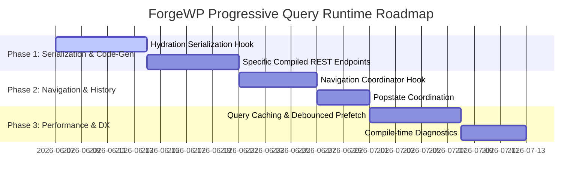

# Roadmap: ForgeWP Progressive Navigation & Query Runtime Architecture

This engineering roadmap outlines the design, implementation milestones, and verification criteria for introducing a **Progressive Navigation & Query Runtime** to the ForgeWP framework. 

This architecture maintains **100% server-rendered static HTML** as the source of truth for SEO and AI crawlers on initial load, while enabling instant, **no-reload, state-coordinated updates** in the browser during filter and search interactions.

---

## 🗺️ High-Level Development Milestones



---

## 🛠️ Detailed Milestones

### Milestone 1: Server-Side Serialization & Hydration State Manager
Eliminate duplicate database query execution and prevent hydration mismatch errors when React bootstraps on the client side.

* **1.1 Server-Side Data Injection (PHP)**:
  * When a query is executed during Server-Side Rendering (SSR) via the PHP template, serialize the initial query payload into a JSON script block in the footer:
    ```html
    <script id="forgewp-initial-state" type="application/json">
      {
        "queries": {
          "hotels_grid_default": {
            "posts": [...initial database records...],
            "total_pages": 3,
            "current_page": 1
          }
        }
      }
    </script>
    ```
* **1.2 Isomorphic Bootstrapping Hook (`useWpQuery`)**:
  * The React hook `useWpQuery` must run both on the server and in the browser with an identical API surface:
    ```typescript
    const { posts, loading, error } = useWpQuery({
      queryId: "hotels_grid",
      postType: "hotel",
      postsPerPage: 12
    });
    ```
  * **Hydration Logic**: During browser hydration, the hook reads from `#forgewp-initial-state` to instantiate its state. It will **not** trigger a network request on mount.

---

### Milestone 2: Specific Compiled REST Endpoints (Compiler-First)
To maximize security and optimize execution speed, **do not expose a generic query route** (e.g., `/forgewp/v1/query`). Instead, compile specific REST routes for each query discovered in the React code.

* **2.1 Query Parser & Specific Route Registration**:
  * The compiler scans React component files for `useWpQuery` calls.
  * For each distinct query, it registers a locked, pre-compiled REST route in `functions.php`:
    ```php
    // Compiled specific endpoint: /wp-json/forgewp/v1/query-hotels-grid
    register_rest_route('forgewp/v1', '/query-hotels-grid', array(
        'methods'             => 'GET',
        'callback'            => 'forgewp_query_hotels_grid_callback',
        'permission_callback' => '__return_true'
    ));
    ```
* **2.2 Parameter Sanitization & Lock-Down**:
  * The compiler hardcodes the query structure (like `'post_type' => 'hotel'`) on the server.
  * The REST callback only exposes predefined inputs (e.g., `country` and `category` taxonomies) and sanitizes them strictly. This prevents hackers or scrapers from altering query variables via browser DevTools.

---

### Milestone 3: Navigation & History Coordinator (URL State Truth)
Maintain the URL search parameters as the single source of truth for the application state. React components merely reflect the URL.

* **3.1 Intercept `setLocation` (History Coordinator)**:
  * Update the framework's `useWpLocation` runtime hook.
  * If a target URL points to the same template page but only alters query variables (e.g., `/hotels/` ➔ `/hotels/?country=italy`), intercept the browser navigation:
    * Call `history.pushState(null, '', newUrl)`.
    * Update the React routing context without triggering a full page reload.
* **3.2 Popstate Synchronization**:
  * Bind to the window's `popstate` event (which fires when the user clicks the browser Back or Forward button).
  * On `popstate`, extract the URL parameters, update the isomorphic query hook, and trigger the corresponding REST request to update the page.

---

### Milestone 4: Performance Layer (Debounced Prefetching & Cache)
Accelerate UI transitions to feel instantaneous through smart prefetching and local browser memory caching.

* **4.1 Memory Caching Hook**:
  * Implement a lightweight key-value cache inside the client-side `useWpQuery` runtime.
  * Query parameters serve as keys:
    ```javascript
    cache["country=austria&category=wellness"] = [...cachedPosts];
    ```
  * When filters are toggled, check the cache first. If hit, render the results instantly, bypassing the REST request.
* **4.2 Mouse-Hover Prefetching with Debounce**:
  * Provide a directive or handler to bind to filter element hovers:
    ```tsx
    <button onMouseEnter={() => coordinator.prefetch({ country: 'austria' })}>
    ```
  * **Debounce Restriction**: Apply an **80ms hover debounce**. The coordinator will only fire a prefetch REST request if the user's cursor hovers over the element for more than 80ms, preventing server load spikes from rapid mouse movements.

---

### Milestone 5: Compile-Time Diagnostics & Warnings
Catch logical configuration errors at compile-time instead of waiting for runtime failures.

* **5.1 Taxonomy and Custom Field Audit**:
  * The compiler parses all query arguments (like `taxQuery` or `metaQuery`) and validates them against the registered custom post types and custom fields defined in `wp.config.ts`.
  * If a developer queries a taxonomy that is not registered for that post type, throw a compiler warning:
    ```text
    ⚠️ [ForgeWP Compile-Time Warning]: useWpQuery in HotelsGrid.tsx queries taxonomy "region", which is not registered for postType "hotel" in wp.config.ts.
    ```
* **5.2 Hydration & Loading States**:
  * Expose a native `loading: boolean` state from `useWpQuery`. 
  * Keep visual loaders (like skeleton UI cards or spinners) decoupled as standard React application-level styles.

---

## 🔍 Validation Plan

1. **SEO Crawler Audit**:
   * Simulate search engine bots (like Googlebot or SearchGPT User-Agent) using `curl -A` targeting `/hotels/?country=austria`.
   * Verify that the initial raw HTML returned by the server contains the fully pre-rendered list of Austrian hotels, proving SSR is fully operational.
2. **Hydration Conflict Verification**:
   * Inspect the browser developer console during navigation. Confirm there are zero React hydration warnings or mismatch alerts.
3. **Navigation & Back-Button Verification**:
   * Navigate through multiple filters, click the browser Back button, and verify the UI updates correctly and coordinates state instantly without page reloads.
4. **Cache & Prefetch Verification**:
   * Check the browser network tab to ensure that:
     * Debounced hovers generate prefetch calls.
     * Re-clicking previously selected filters loads results instantly from the memory cache with zero network requests.
