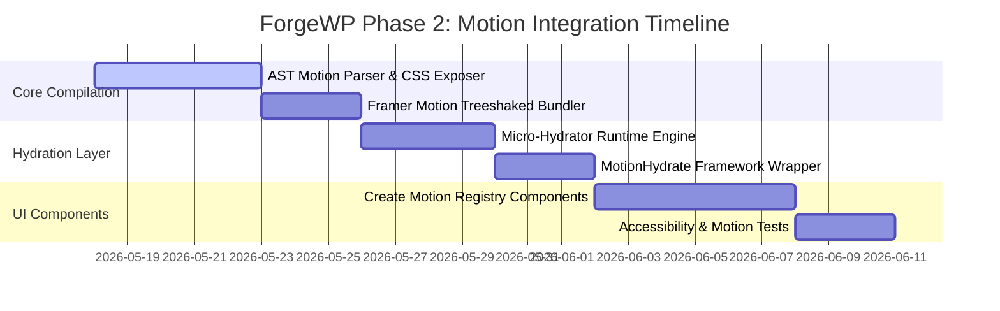

# ForgeWP Phase 2: Motion Integration Specification
**Status:** PROPOSED (RFC)  
**Author:** ForgeWP Architecture Team  
**Target Version:** v0.3.0  

---

## 1. Executive Summary

This document specifies the technical design for integrating high-performance animations into the ForgeWP compiler and runtime engine. 

While Framer Motion is supported out of the box as the primary React animation runtime, the underlying ForgeWP selective hydration and static pre-rendering architecture is **100% animation-library agnostic**. Whether the developer uses Framer Motion, GSAP, Motion One, Anime.js, or pure Tailwind CSS transitions, the compiler handles them with zero-bloat efficiency:
1. All initial visual animation states (opacity, offsets, scale) are compiled directly into raw static CSS/HTML at build-time, completely preventing Flash of Unstyled Content (FOUC) and CLS.
2. Custom animation JS bundles are **never loaded on initial load**; they are loaded dynamically via lazy ESM imports only when an interactive boundary enters the viewport.

---

## 2. System Architecture

```text
+-------------------------------------------------------------+
|                     React Source Files                      |
|       (e.g., HeroSection.tsx using <MotionHydrate>)         |
+-------------------------------------------------------------+
                              │
                              ▼
+-------------------------------------------------------------+
|                       ForgeWP Compiler                      |
|  1. Pre-renders React component to static markup.           |
|  2. Extracts animation properties (initial/animate) using AST|
|  3. Injects static initial CSS rules (e.g. opacity: 0).     |
+-------------------------------------------------------------+
                              │
                              ▼
+-------------------------------------------------------------+
|                   WordPress Theme Output                    |
|  - HTML: Pre-rendered, static initial states ready.         |
|  - JS: Split into isolated dynamic chunks for viewport load. |
+-------------------------------------------------------------+
                              │
                              ▼
+-------------------------------------------------------------+
|                      Client-Side Loading                    |
|  - 1. Instant HTML render (GPU handles initial state).      |
|  - 2. Micro-Hydrator (2KB) runs IntersectionObserver.       |
|  - 3. Dynamic import() fetches Framer Motion on demand.    |
|  - 4. Component hydrates and executes target animation.     |
+-------------------------------------------------------------+
```

---

## 3. Core Technical Mechanics

### 3.1. Build-Time: Static Pre-rendering of Initial States (Zero CLS)

Framer Motion standard components (`<motion.div>`) do not output initial CSS attributes (like `opacity: 0` or `transform: translateY(20px)`) when rendered statically via `renderToStaticMarkup`. This leads to a FOUC where elements render at 100% size/opacity and then instantly pop to their initial animated state once JavaScript boots up.

#### The AST Compiler Transformer:
ForgeWP's compiler will intercept React code files and scan for `<motion.*>` tags. During the static transpile phase, the compiler:
1. Parses the `initial` and `animate` property objects.
2. Formulates a matching temporary static style string.
3. Injects it directly into the static HTML wrapper or as an inline `style` attribute.

```typescript
// Compiler Transformer Logic (AST Ingestion)
export function compileMotionPropsToStaticStyle(props: Record<string, any>): string {
  const initial = props.initial;
  if (!initial || typeof initial !== "object") return "";

  const styles: string[] = [];

  if (initial.opacity !== undefined) styles.push(`opacity: ${initial.opacity}`);
  
  let transform = "";
  if (initial.y !== undefined) transform += ` translateY(${typeof initial.y === "number" ? initial.y + "px" : initial.y})`;
  if (initial.x !== undefined) transform += ` translateX(${typeof initial.x === "number" ? initial.x + "px" : initial.x})`;
  if (initial.scale !== undefined) transform += ` scale(${initial.scale})`;
  if (initial.rotate !== undefined) transform += ` rotate(${initial.rotate}deg)`;

  if (transform) styles.push(`transform:${transform}`);

  return styles.join("; ");
}
```

*Output Example:*  
`<motion.div initial={{ opacity: 0, y: 30 }} animate={{ opacity: 1, y: 0 }}>`  
is compiled to:  
`<div class="forgewp-motion-node" style="opacity: 0; transform: translateY(30px);">`

---

### 3.2. Runtime: Selective Hydration Boundaries (`<Hydrate>`)

To avoid shipping expensive visual libraries sitewide by default, ForgeWP introduces the framework-controlled `<Hydrate>` boundary. 

This architecture is **completely library-agnostic**:
1. **Pure Tailwind & CSS Animations (Zero JavaScript Overhead):** Standard transitions (e.g. `transition-transform duration-300 hover:scale-105`) require absolutely no hydration. They are compiled directly into raw static HTML and utility CSS classes, functioning perfectly with **0KB of client-side JavaScript**.
2. **Dynamic JS Animation Libraries (GSAP, Motion One, Anime.js, Framer Motion):** If a component uses complex JS animations, the `<Hydrate>` boundary dynamically code-splits that component (along with its imported libraries) into isolated assets. These assets are only fetched and parsed by the browser when the trigger fires.

#### The Triple-Trigger Strategy:
ForgeWP implements three core hydration triggers for maximum performance balancing:

| Trigger | Description | Target Use-Case |
| :--- | :--- | :--- |
| `load` | Hydrates immediately after `DOMContentLoaded` resolves. | Above-the-fold hero animations, interactive carousels. |
| `visible` | Hydrates lazily when the boundary enters the viewport (using `IntersectionObserver`). | Scroll reveals, animated footer columns. |
| `interaction` | Defers hydration until a user triggers a `click`, `mouseenter`, or `focus` event. | Lightbox modals, dropdown drawers, dynamic searchbars. |

#### The Developer API:
```tsx
import { motion } from "framer-motion";
import { Hydrate } from "@forgewp/react";

export default function HeroSection() {
  return (
    // ⚡ Above-the-fold loads immediately to satisfy layout triggers
    <Hydrate trigger="load">
      <motion.div
        initial={{ opacity: 0, y: 50 }}
        animate={{ opacity: 1, y: 0 }}
        className="p-12 border-4 border-black bg-yellow-400 font-bold"
      >
        <h1>Welcome to ForgeWP Premium Experiences</h1>
      </motion.div>
    </Hydrate>
  );
}
```

#### The Client-Side Micro-Hydrator (Hydration Engine):
ForgeWP injects a tiny, lightning-fast vanilla script (`forgewp-hydrator.js`, `<2KB`) inside the compiled `header.php`. This script coordinates all three triggers elegantly:

```javascript
// forgewp-hydrator.js (Inline runtime script)
(function() {
  document.addEventListener("DOMContentLoaded", () => {
    const hydrateNode = (target) => {
      const bundleName = target.getAttribute("data-forgewp-hydrate");
      const propsData = JSON.parse(target.getAttribute("data-forgewp-props") || "{}");
      
      // Dynamic ESM loading
      import(`./assets/${bundleName}.js`).then((module) => {
        const HydratedComponent = module.default;
        const root = ReactDOM.createRoot(target);
        root.render(React.createElement(HydratedComponent, propsData));
      });
    };

    const visibleObserver = new IntersectionObserver((entries) => {
      entries.forEach(entry => {
        if (entry.isIntersecting) {
          visibleObserver.unobserve(entry.target);
          hydrateNode(entry.target);
        }
      });
    }, { threshold: 0.1, rootMargin: "100px" });

    // Scan and hook up targets
    document.querySelectorAll("[data-forgewp-hydrate]").forEach(el => {
      const trigger = el.getAttribute("data-forgewp-trigger");

      if (trigger === "load") {
        // 1. Load trigger
        window.addEventListener("load", () => hydrateNode(el));
      } else if (trigger === "visible") {
        // 2. Viewport trigger
        visibleObserver.observe(el);
      } else if (trigger === "interaction") {
        // 3. User interaction triggers (click, hover, focus)
        const runInteraction = () => {
          el.removeEventListener("click", runInteraction);
          el.removeEventListener("mouseenter", runInteraction);
          hydrateNode(el);
        };
        el.addEventListener("click", runInteraction);
        el.addEventListener("mouseenter", runInteraction);
      }
    });
  });
})();
```

---

## 4. The Asset and Compiling Pipeline

### 4.1. Code Splitting and Dynamic Chunks Generation
The compiler splits JavaScript during `forgewp export` via Vite/Esbuild configurations:
*   **`forgewp-main.js`**: Core lightweight framework runtime.
*   **`motion-core.js`**: Treeshaked `framer-motion` package shared among dynamic islands.
*   **Individual Component Chunks**: Dynamically imported, isolated files created per `<MotionHydrate>` wrapper.

#### Vite Build Configuration (`vite.config.ts` mapping):
```typescript
build: {
  rollupOptions: {
    output: {
      manualChunks(id) {
        if (id.includes("node_modules/framer-motion")) {
          return "motion-core";
        }
        if (id.includes("node_modules/react") || id.includes("node_modules/react-dom")) {
          return "react-core";
        }
      }
    }
  }
}
```

---

## 5. Developer Accessibility Standards

To satisfy modern global accessibility regulations, ForgeWP automatically integrates **`prefers-reduced-motion`** protections. 

Developers do not have to write custom media queries for every single animation. The compiler wraps and injects active detection:

```typescript
// Core React Hook in @forgewp/react
import { useEffect, useState } from "react";

export function useReducedMotion(): boolean {
  const [reduced, setReduced] = useState(false);

  useEffect(() => {
    const mediaQuery = window.matchMedia("(prefers-reduced-motion: reduce)");
    setReduced(mediaQuery.matches);

    const listener = (event: MediaQueryListEvent) => setReduced(event.matches);
    mediaQuery.addEventListener("change", listener);
    return () => mediaQuery.removeEventListener("change", listener);
  }, []);

  return reduced;
}
```

Inside components:
```tsx
const reduced = useReducedMotion();
const animationConfig = reduced 
  ? { opacity: 1, y: 0 } 
  : { opacity: 1, y: 0 };
```

---

## 6. Phase 2 Implementation Timeline



---

## 7. Resolved Architectural Decisions (Framework Manifesto)

Based on the RFC review and strategic developer alignment, the core architectural standards of ForgeWP are finalized as follows:

### 7.1. The Framework-Agnostic Adapter Strategy
ForgeWP is positioned **not simply as a React framework**, but as a **modern frontend framework and compiler platform for building native WordPress themes**. 
* **The Compiler & WordPress Export Pipeline** represent the absolute framework core (handling PHP transpilation, block registrations, asset splitting, routing, and database schema mappings).
* **Frontend Frameworks** are treated strictly as **Adapters** (e.g., the primary React+Vite adapter).
* This ensures Svelte, Vue, or Next.js adapters can easily hook into the core pipeline in future phases without destabilizing the core.

### 7.2. The Hybrid Motion & Component Registry Paradigm
To avoid creating rigid visual abstractions and "abstraction prisons", ForgeWP strictly divides visual UI and core framework infrastructure:
* **The shadcn Component Philosophy:** All visual layout/animation components (e.g. scaffolded via `pnpm forgewp add stagger-reveal`) are **copied as raw, editable source files** directly into the developer's project folder (`src/components/ui/`). The developer has absolute ownership of easing, timing, responsiveness, and variants.
* **Minimal Infrastructure in Runtime:** Primitive utilities, hooks (e.g., `useReducedMotion()`), and hydration controllers (e.g., `<Hydrate>`) reside in `@forgewp/react` to orchestrate underlying compiler optimization.

---
