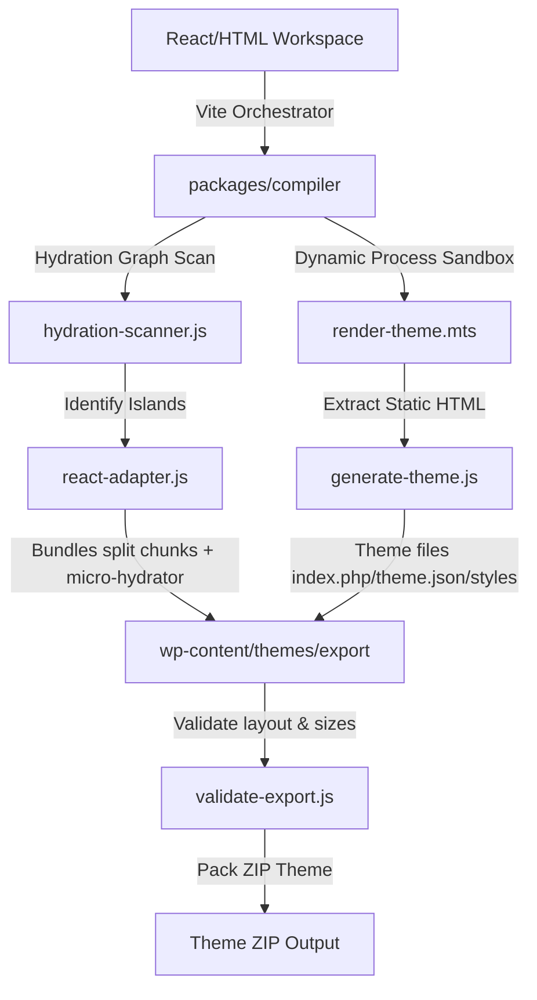

# ForgeWP — Strategic Roadmap Audit & Gap Analysis

This document provides a highly structured technical audit of the **ForgeWP** monorepo against the strategic roadmap outlined in [forgewp_architecture_review_and_strategic_roadmap.md](file:///c:/Users/hp/Desktop/ForgeWP/forgewp_architecture_review_and_strategic_roadmap.md). It details exactly what has been completed, what is in progress, and what remains to be built across each strategic phase.

---

## 🗺️ High-Level Core Philosophy Alignment

ForgeWP’s stated core philosophy is:
> **“Minimal JavaScript by default. Powerful interactivity by intention.”**

The architecture is built as **modern frontend infrastructure for WordPress** (static-first pages, selective hydration, explicit island boundaries) rather than a bloated client-side SPA or a no-code visual drag-and-drop page builder.

### 🏗️ Monorepo Pipeline Overview

---

## 📊 Strategic Phase & Capability Matrix

| Strategic Phase | Capability / Feature | Status | Codebase Modules / Files |
| :--- | :--- | :--- | :--- |
| **Phase 1: Foundation** | Compiler Core Pipeline | **100% Complete** | [`generate-theme.js`](file:///c:/Users/hp/Desktop/ForgeWP/packages/compiler/lib/generate-theme.js) [`render-theme.mts`](file:///c:/Users/hp/Desktop/ForgeWP/packages/compiler/lib/render-theme.mts) [`hydration-scanner.js`](file:///c:/Users/hp/Desktop/ForgeWP/packages/compiler/lib/hydration-scanner.js) |
| | React Adapter Core | **100% Complete** | [`react-adapter.js`](file:///c:/Users/hp/Desktop/ForgeWP/packages/compiler/lib/react-adapter.js) [`packages/react/src/`](file:///c:/Users/hp/Desktop/ForgeWP/packages/react/src/) |
| | Static-first HTML Adapter | **100% Complete** | [`html-adapter.js`](file:///c:/Users/hp/Desktop/ForgeWP/packages/compiler/lib/adapters/html-adapter.js) [`packages/html-starter/`](file:///c:/Users/hp/Desktop/ForgeWP/packages/html-starter/) |
| | Micro-Hydration Runtime | **100% Complete** | Embedded in [`react-adapter.js`](file:///c:/Users/hp/Desktop/ForgeWP/packages/compiler/lib/react-adapter.js) & compiled into `forgewp-hydrator.js` |
| | WP Export Pipeline | **100% Complete** | [`export-theme.js`](file:///c:/Users/hp/Desktop/ForgeWP/packages/compiler/lib/export-theme.js) [`zip-theme.js`](file:///c:/Users/hp/Desktop/ForgeWP/packages/compiler/lib/zip-theme.js) |
| | Native Theme Hierarchy | **100% Complete** | [`blueprints.js`](file:///c:/Users/hp/Desktop/ForgeWP/packages/compiler/lib/blueprints.js) (scaffolds PHP/JSON templates) |
| **Phase 2: Developer Experience**| Command Line Interface (CLI) | **100% Complete** | [`packages/compiler/bin/`](file:///c:/Users/hp/Desktop/ForgeWP/packages/compiler/bin/) (`cli.js`, `sync-routes.js`, etc.) |
| | Diagnostics System (Doctor) | **100% Complete** | [`doctor.js`](file:///c:/Users/hp/Desktop/ForgeWP/packages/compiler/bin/doctor.js) [`validate-export.js`](file:///c:/Users/hp/Desktop/ForgeWP/packages/compiler/lib/validate-export.js) |
| | Self-Healing Repair system | **100% Complete** | [`repair.js`](file:///c:/Users/hp/Desktop/ForgeWP/packages/compiler/bin/repair.js) [`blueprints.js`](file:///c:/Users/hp/Desktop/ForgeWP/packages/compiler/lib/blueprints.js) |
| | Brutalist Component Registry | **100% Complete** | [`registry.js`](file:///c:/Users/hp/Desktop/ForgeWP/packages/create-forgewp/lib/registry.js) [`add-component.js`](file:///c:/Users/hp/Desktop/ForgeWP/packages/compiler/lib/add-component.js) |
| | Starter Templates | **100% Complete** | [`packages/starter/`](file:///c:/Users/hp/Desktop/ForgeWP/packages/starter/) (React) [`packages/html-starter/`](file:///c:/Users/hp/Desktop/ForgeWP/packages/html-starter/) (HTML) |
| | Hydration Devtools & Analyzer | **Remaining** | *Not Yet Implemented* (Major opportunity to visualize island graphs) |
| **Phase 3: Ecosystem Expansion** | Vue / Svelte Adapters | **Planned** | [`stub-adapter.js`](file:///c:/Users/hp/Desktop/ForgeWP/packages/compiler/lib/adapters/stub-adapter.js) outlines lifecycle methods |
| | WooCommerce Integrations | **Planned** | *Not Yet Implemented* (Needs WooCommerce block state syncing) |
| | Headless Hybrid Rendering | **Planned** | *Not Yet Implemented* (Target `forgewp build --hybrid`) |
| | Figma / Visual Tooling | **Planned** | *Not Yet Implemented* |

---

## 🔍 Deep-Dive: What Has Been Done

### 1. Phase 1: Foundation (95% Complete)

*   **Compiler Core (`packages/compiler`):**
    *   **Orchestration Engine (`generate-theme.js`):** Integrates directly with Vite to compile React pages, assets, and code-split chunks. Automatically builds standard PHP wrappers for pages.
    *   **SSR Dynamic Sandboxing (`render-theme.mts`):** Boots up a Node process that executes page templates and layouts to render actual HTML markup server-side. Ensures all layouts are SSR-safe with error boundaries.
    *   **Selective Hydration Scanner (`hydration-scanner.js`):** Parses the components to locate occurrences of `<Hydrate>` and builds the hydration dependency manifest. It automatically discovers interactive structures and enforces split bundles.
*   **React Adapter & Components (`packages/react`):**
    *   **Hydration Boundary Wrapper (`Hydrate.tsx`):** Provides an explicit API (`trigger="load" | "visible" | "interaction" | "idle"`) that serializes component props into `data-forgewp-*` HTML attributes, allowing zero-overhead SSR rendering.
    *   **WordPress Bridges:**
        *   `WpQueryLoop.tsx`: Bridges WordPress dynamic loops (e.g. rendering custom post types/pages in React) and renders native loops in PHP.
        *   `WpMenu.tsx`: Enqueues WP menus in local dev and uses WordPress’s native `wp_nav_menu()` in exported PHP.
        *   `WpShortcode.tsx`: Mounts standard WP shortcodes.
*   **Micro-Hydration Runtime (Embedded in Compiler):**
    *   Generates `forgewp-hydrator.js` (an ultra-lightweight, 0-dependency, performance-tuned script).
    *   **Strategy Registry:**
        *   `load`: Runs immediately or as soon as the page is ready.
        *   `visible`: Lazily initiates hydration using an `IntersectionObserver` when the island enters the viewport (with `rootMargin: "200px"`).
        *   `interaction`: Hydrates dynamically on `click`, `mouseenter`, or `focusin` events.
        *   `idle`: Uses `requestIdleCallback` with a `setTimeout` fallback to execute during browser idle time.
*   **WordPress Export Pipeline (`export-theme.js`, `zip-theme.js`, `validate-export.js`):**
    *   Compiles output directory with standard WordPress block-theme layouts (`index.php`, `header.php`, `footer.php`, `functions.php`, `theme.json`, `404.php`, `front-page.php`, `single.php`, `archive.php`, `page.php`).
    *   Zips the entire output directory into an installable WordPress theme package.
    *   Runs rigorous integrity assertions (checking that all templates are populated and required JS chunks are bundled).

### 2. Phase 2: Developer Experience (50% Complete)

*   **Robust CLI Architecture (`packages/compiler/bin/`):**
    *   `forgewp doctor`: Evaluates environmental and project conditions (Node runtime, configuration files, SQLite mock data integrity, system directory structures, and global Tailwind setups).
    *   `forgewp repair`: Automatically regenerates framework-critical internal files (e.g., config types, SEO headers, color preset wrappers) from integrated `blueprints.js` templates if accidentally altered.
    *   `forgewp sync:routes`: Maps routes specified in `src/app/routes.tsx` to native WordPress pages automatically.
    *   `forgewp make:block`: Scaffolds standard block assets, PHP entry points, and React frontends.
    *   `forgewp make:component` / `forgewp make:post-type`: Easily creates dynamic assets and theme database schemas.
*   **shadcn-style Registry Engine (`packages/create-forgewp`):**
    *   Integrates a modular component registry in `lib/registry.js` supporting shadcn-style component scaffolding.
    *   Supports adding preconfigured styles or custom items directly to the working workspace (`pnpm forgewp add navbar`).

---

## 🎯 What We Have Left to Do

### 1. Compiler Diagnostics & Hydration Analyzer (Phase 2 - High Opportunity)
The roadmap calls out **Compiler Diagnostics** and a **Hydration Devtools Analyzer** as two of the biggest opportunities to achieve elite status.
*   **The Goal:** Build an automated analyzer that scans compiled pages and warns developers about heavy elements or inefficient islands.
*   **What needs to be built:**
    *   Analyze the bundle size of individual interactive components inside Vite's manifest.
    *   If an island exceeds an estimated threshold (e.g. 100kb), print a warning in the CLI output with optimization recommendations (e.g., *"Suggest splitting components into nested sub-islands"* or *"Switch trigger from visible to interaction"*).
    *   Create a visual Build Graph / Island Map showing which islands are dynamic, which are static, and what triggers are attached.

### 2. Recommended Advanced Hydration Triggers (Phase 1/2)
Extend the hydration triggers in `<Hydrate>` and the micro-hydrator:
*   **Predictive Preloading:** Implement a `preload="near-visible"` strategy that preloads the component's bundle script when it is close to the viewport, but delays hydration until it actually intersects.
*   **Network-Aware Hydration:** Hook into `navigator.connection` and defer/prevent heavy hydration or dynamic chunks if the user is on a slow 2G/3G network.
*   **Media-Query Hydration:** Implement a `media="(max-width: 768px)"` trigger that only boots the dynamic bundle on specific screen dimensions (e.g., avoiding dynamic sidebars on mobile).

### 3. Vue / Svelte Adapters (Phase 3 - Ecosystem Expansion)
*   **The Goal:** Support framework-agnostic compiler layers.
*   **What needs to be built:**
    *   Create concrete `@forgewp/vue` and `@forgewp/svelte` adapters implementing the lifecycle methods outlined in `packages/compiler/lib/framework-adapter.js`.
    *   Add Vue-specific and Svelte-specific hydration wrappers.

### 4. WooCommerce Support (Phase 3)
*   **The Goal:** Seamless e-commerce capabilities.
*   **What needs to be built:**
    *   Create state-preserving hydration loops for shopping carts, checkout components, and catalog grids so dynamic interactions don't break WordPress's PHP session/REST states.

### 5. Headless Hybrid Rendering Mode (Phase 3 - Strategic Peak)
*   **The Goal:** Allow compilation to hybrid setups beyond standard WordPress block themes.
*   **What needs to be built:**
    *   Support `forgewp build --hybrid` to generate highly decoupled, edge-cacheable static assets that retrieve content from the WordPress REST/GraphQL API instead of embedding PHP loops.

---

## 🏁 Recommended Immediate Next Steps

To maximize developer experience and build on top of our pristine foundations, our next developmental sprint should prioritize:

1.  **Enriching Hydration Diagnostics:** Connect `validate-export.js` and `doctor.js` to calculate compiled chunk sizes of islands and output optimization suggestions to the terminal screen.
2.  **Integrating Advanced Triggers:** Enhance `<Hydrate>` to support network conditions, screen media sizes, and predictive near-viewport prefetching.
3.  **Extending the Component Registry:** Add additional standard layout blueprints and widgets to the registry (`packages/create-forgewp/lib/registry.js`) for rapid UI prototyping.
