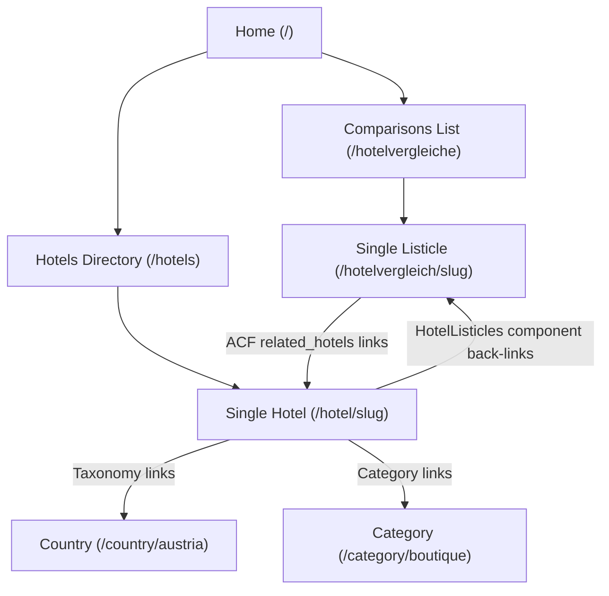

# GEO Architecture & AI Crawlability Review

This document evaluates the architecture of the **Hotelchecker24** platform through the lens of AI search engines (e.g., Google SearchGPT, Perplexity, OpenAI Search, Gemini) and traditional search crawlers. 

AI crawlers value **high-confidence data structures**, **clear hierarchy**, and **semantic markup** to build authority graphs and extract citations.

---

## 🗺️ Architectural Evaluation by Pillar

### 1. URL Structure
#### Current Mappings
In the compiled ForgeWP WordPress theme, URLs follow logical, predictable, and language-aware routes:
* **Homepages**: `/` (Default/DE) and `/en/` (EN).
* **Hotel Profiles**: `/hotel/grand-ferdinand-vienna/` (DE) and `/en/hotel/grand-ferdinand-vienna/` (EN).
* **Hotel Comparisons (Listicles)**: `/hotelvergleich/spas-alpen/` (DE) and `/en/hotelvergleich/spas-alpen/` (EN).
* **Taxonomy Archives (Country/Region)**: `/country/austria/vienna/` (hierarchical terms).
* **Taxonomy Archives (Categories)**: `/category/wellness/` or `/category/boutique/`.

#### Addressing the `/austria/vienna/boutique-hotels/` Question
We do not have `/austria/vienna/boutique-hotels/` URLs natively.
* **The Reason**: In standard WordPress routing, route resolution maps a request to a single main database object (a post type or a taxonomy). A URL containing multiple distinct taxonomies (`country` + CPT category) is not natively resolvable. 
* **AI & Human readability**: While `/austria/vienna/boutique-hotels/` is highly descriptive, search engines do not rely solely on URLs to infer relationships. In fact, deep arbitrary paths without distinct entity prefixes (like `/hotel/` or `/country/`) can lead to route collisions (e.g., if a page is named `/austria/`), which confuses crawlers.
* **Our Current Solution**: We use highly clean, translatable taxonomy URLs (like `/de/country/austria/wien/`) and CPT URLs (like `/de/hotel/grand-ferdinand-vienna/`), combined with schema graphs to represent hierarchies.

---

### 2. Internal Linking
AI tools follow internal linking pathways to establish topic authority. We have created a **highly connected mesh** between hotels, comparison listicles, and category archives:

* **Bidirectional Relationships**: 
  * A **Listicle** page links directly to individual featured **Hotel Profiles**.
  * A **Hotel Profile** dynamically query-renders and links back to every comparison listicle featuring it (via the `HotelListicles` hydration component).
* **Breadcrumb Navigation**: Every inner page contains a structured breadcrumb layout with explicit links back to home, category lists, or parent archives. This makes it impossible for crawlers to encounter "orphan pages".

---

### 3. Taxonomy Hierarchy
We use a clean, native-mode taxonomy structure that resolves confusing paths:
* **Hierarchical Countries & Cities**: The `country` taxonomy is registered as hierarchical (`'hierarchical' => true`). This allows you to set up `Austria` as a top-level term, and `Vienna` as a child term under it in the WordPress admin. 
* **Automated Slug Paths**: WordPress automatically handles hierarchical slug paths. If a term `Vienna` (slug `vienna`) has a parent `Austria` (slug `austria`), its archive path is compiled as `/country/austria/vienna/`.
* **Consistency**: The hierarchy is maintained across both languages using Polylang, mapping English taxonomy terms to German counterparts.

---

### 4. Content Structure
To cite a website with high confidence, an LLM must easily parse page elements without guessing. We ensure this by using semantic HTML5 and React state hydration:
* **Semantic Micro-formatting**: Hotels are structured in `<article>` containers, utilizing standard tags:
  * `<h1>` for Title.
  * Precise coordinates (`latitude`, `longitude`) rendered in state.
  * Meta fields (address, stars rating) printed clearly in page templates.
* **Predictable Comparison Layouts**: Listicles render each featured hotel with consistent card layout structures, utilizing exact names, star counts, and external links.

---

## ⚡ The Schema Integration (GEO Engine Secret Weapon)

While URL structures are hints, **Structured Data (JSON-LD) is a direct instruction.** Because we output custom JSON-LD schemas, search engine crawlers and LLMs build a perfect relationship graph:

1. **BreadcrumbList Schema**: Tells AI the exact position of a page in the taxonomy tree:
   `Home` ➔ `Austria` ➔ `Vienna` ➔ `Grand Ferdinand Hotel`
2. **Hotel Schema**: Delivers high-precision metadata for hotel profiles (coordinates, ratings, price category, contact detail).
3. **ItemList Schema**: On a comparison listicle, this lists all featured hotels, their positions, and descriptions in a machine-readable format.
4. **Relationship Linking**: The schema links the hotel profile's web entity to its physical address and location terms, allowing AI agents to know *exactly* that `Grand Ferdinand` belongs to the location `Vienna` in `Austria` even if the URL is simply `/hotel/grand-ferdinand-vienna/`.

---

## 🛠️ Blueprint: How to Support `/country/region/category/` URLs in WP

If you want to support combined hierarchical URLs like `/explore/austria/vienna/boutique-hotels/` in the future, it requires configuring a custom routing layer in WordPress. Here is the architectural blueprint to achieve it:

### Step 1: Add Custom Routing Variables
Configure WordPress to recognize three custom URL parameters: country, region, and hotel category. This allows the system to extract these variables from the incoming URL slug.

### Step 2: Register Custom Rewrite Rules
Set up matching rules that map any web request following the pattern `/explore/country/region/category/` to your main hotels directory page, while passing the custom parameters along behind the scenes.

### Step 3: Implement Query Filtering on the Template Page
On the target directory template page, read the custom parameters (country, region, category) and filter the hotel database query to only fetch and render hotels that match all three classifications.

---

## ⚠️ Design Trade-offs & Risks

1. **Route Collision**: Generic multi-level routing paths can intercept other page paths or subpages in WordPress, breaking normal navigation. Prefixing the URL path with a constant term (like `/explore/`) is required to keep routing safe.
2. **Multilingual Compatibility**: Integrating custom URL patterns with Polylang requires registering separate rewrite rules for each active language prefix (e.g. `/en/explore/` vs `/de/explore/`), which adds significant administrative complexity.
3. **Admin Complexity**: Managing custom routing patterns in WordPress requires manually flushing permalinks after every change and is more fragile to debug than native hierarchical taxonomy systems.
