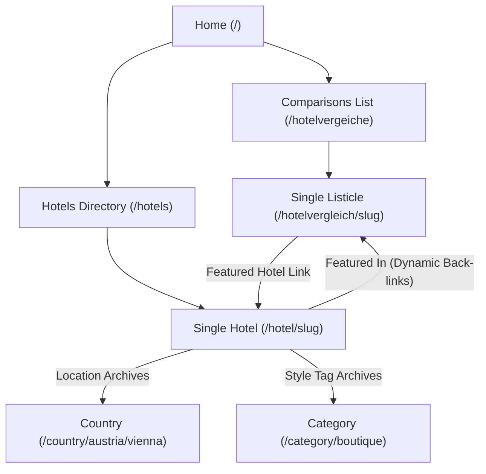

# 🗺️ GEO & SEO Strategy and Architecture: hotelchecker24.com

This document outlines the Search Engine Optimization (SEO) and Generative Engine Optimization (GEO) architecture implemented on the **Hotelchecker24** platform. 

To maximize the site's visibility on traditional search engines (such as Google and Bing) as well as modern AI search engines (like ChatGPT Search, Perplexity, Google Gemini, and Copilot), the platform is built on a highly structured, semantic foundation. AI search engines prioritize websites that present clear, verified relationships between real-world entities (such as cities, hotels, and rankings) in a machine-readable format.

---

## 🏛️ 1. Core SEO Foundation

### A. Logical URL Routing & Location Hierarchy
The website maps content into clear, translatable, and hierarchically nested URL paths. This makes it easy for both human visitors and search crawlers to understand where they are on the site:
* **Homepages:** The main entry points are separated by language: `/` for German and `/en/` for English.
* **Hotel Profiles:** Individual hotel pages use clean paths: `/hotel/hotel-name/` (German) and `/en/hotel/hotel-name/` (English).
* **Hotel Comparisons (Listicles):** Curated articles comparing multiple hotels use dedicated routes: `/hotelvergleich/article-title/` (German) and `/en/hotelvergleich/article-title/` (English).
* **Location Directory:** Countries and cities are structured hierarchically (e.g., Parent Country ➔ Child City resolves to `/country/austria/vienna/`).
* **Category Archives:** Curated categories list hotels by type (e.g., `/category/wellness/`, `/category/boutique/`).

### B. Multilingual & Locale Management
To capture international traffic and support a bilingual setup (German and English) without search penalty risks:
* **Cross-Language Alternates (Hreflang):** The platform automatically communicates language relationships directly to search engines. For every page, it tags the English and German equivalents so Google can deliver the correct language version to users based on their location.
* **Smart Language Resolution:** Navigation links automatically adjust to the user's active language, ensuring that crawlers do not get lost switching back and forth between German and English.

### C. Internal Linking & Content Connectivity
AI search engines build authority graphs by tracing how pages link to one another. The theme connects hotels, comparisons, and locations in a bidirectional grid:

* **Comparisons ➔ Hotel Profiles:** Comparison articles present hotels in structured layouts and link directly to each hotel's profile page.
* **Hotel Profiles ➔ Comparisons:** Every hotel page automatically displays a list of all comparison articles featuring that hotel, creating natural, automatic back-links.

---

## ⚡ 2. The GEO Layer: Structured Data (JSON-LD)

While clean URL structures are hints, **Structured Data is a direct, machine-readable instruction set.** By publishing custom schemas, the site delivers a high-confidence entity map that AI engines use to generate direct answers and citations.

The platform outputs the following schemas:

### A. Breadcrumb Schema (Site Navigation Path)
This details the exact hierarchy of a page. It tells search bots how a page fits into the site structure:
* **For Hotel Pages:** `Home` ➔ `Country` ➔ `City` ➔ `Category` ➔ `Hotel Name`
* **For Listicles:** `Home` ➔ `Comparisons Archive` ➔ `Listicle Title`
* **For Location Lists:** `Home` ➔ `Country` ➔ `City`

### B. Hotel Profile Schema (Detailed Business Data)
Provides structured, verified data points for each hotel profile, including:
* **Exact Location:** The street address, city, and country.
* **Map Coordinates:** Exact latitude and longitude. AI engines use these coordinates to pin the hotel to mapping systems and recommend it for location-specific queries (e.g., "hotels near center of Vienna").
* **Hotel Class:** The official star rating (1–5 stars).
* **Editorial Rating:** The platform's expert review score on a 1.0–5.0 scale.
* **Contact Details:** The hotel's website and email address.

### C. ItemList Schema (Ranked Listings)
On comparison pages, this schema outputs the hotels in their exact ranked order. AI engines use this list to understand top-recommended spots (e.g., "What is the number one spa hotel in Tyrol?"):
* Includes the hotel's rank position, name, dedicated page URL, and a short summary.

### D. Seamless SEO Plugin Integration (Yoast SEO & RankMath)
To ensure search crawlers are not confused by multiple conflicting schema codes, the theme automatically merges its custom data into your active SEO plugin (such as Yoast SEO or RankMath). Rather than displaying separate blocks of code, the system blends them into a single, unified graph.
*(If no SEO plugin is active, the theme automatically outputs its own clean structured data blocks instead.)*

---

## ⚙️ 3. WP-Admin Content Management & Best Practices

To maintain search engine visibility, follow these entry guidelines when managing content in the WordPress backend:

### A. Metadata Setup for Hotels
When adding a new hotel profile, ensure the following fields are filled out:
* **Featured Image:** Always upload a high-quality main image. This sets the image property in the search engine's database.
* **Coordinates:** Provide the **Latitude** and **Longitude** to trigger map-based recommendations.
* **Excerpt:** Write a short, engaging 1-2 sentence summary. AI bots read this excerpt to formulate quick answers.
* **External Links:** Set the hotel's official website URL to establish credibility.

### B. Author Profile Configurations
To display clean author names on comparison posts:
1. Go to **Users ➔ Profile** in your WordPress dashboard.
2. Fill out your First Name, Last Name, and **Nickname**.
3. Under **"Display name publicly as"**, select your full name instead of the default username (like "Admin").
4. This ensures search engines attribute the content to a real editorial author.

### C. Yoast SEO Optimization Check
* **Meta Descriptions:** If a custom meta description is missing for a page, Yoast will show a warning in the backend. You can write custom meta descriptions for each post, or set up automated templates in the Yoast settings to generate them from the post excerpt.
* **Sitemaps:** Make sure XML Sitemaps are active in the Yoast settings (this creates the sitemap index at `/sitemap_index.xml` automatically).

---

## 📈 4. Submitting Your Sitemap to Google Search Console

Submitting your sitemap directly to Google helps search engine bots discover new hotels and comparison articles instantly. Follow these steps to locate and submit your sitemap:

### Step 1: Retrieve the Sitemap URL from Yoast SEO
1. Log in to your WordPress Admin Dashboard.
2. In the left-hand navigation sidebar, click on **Yoast SEO** and select **Settings**.
3. Under the **Site features** settings tab, scroll down to the **XML sitemaps** feature card.
4. Ensure that the **XML sitemaps** toggle switch is turned **ON** (enabled).
5. Click on the link that says **"See the XML sitemap"** (or click the question mark icon next to it and select the sitemap link).
6. A new tab will open in your browser displaying your sitemap index.
7. Look at the browser's address bar and copy the sitemap file name at the end of the URL, which will be: **`sitemap_index.xml`** (e.g., in `https://hotelchecker24.com/sitemap_index.xml`).

### Step 2: Open Google Search Console
1. Go to [Google Search Console](https://search.google.com/search-console).
2. Log in using the Google account associated with your website.

### Step 3: Select Your Site Property
1. In the top-left corner, click the **Property Selector** dropdown.
2. Select your live website URL (e.g., `https://hotelchecker24.com`).
   * *Note: If your website is not listed, click **Add Property** and follow Google's verification instructions to verify ownership of your domain.*

### Step 4: Go to the Sitemaps Menu
1. Look at the left-hand navigation sidebar.
2. Under the **Indexing** section, click on **Sitemaps**.

### Step 5: Submit the Sitemap Index
1. Under the **"Add a new sitemap"** text field, you will see your website URL.
2. In the input box next to it, type: **`sitemap_index.xml`**
3. Click the **Submit** button.

### Step 6: Confirm the Indexing Status
1. Once submitted, look at the **"Submitted sitemaps"** list at the bottom of the page.
2. Verify that the status column displays **"Success"** in green.
3. You will see the total count of discovered pages, hotels, and categories that Google has parsed and queued for indexing.
