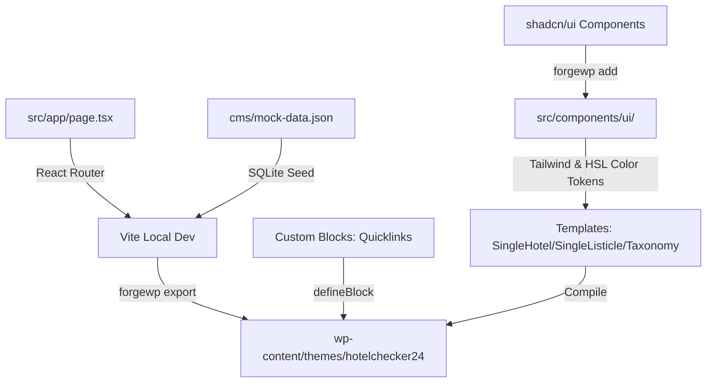

# Implementation Plan: Hotelchecker24 Platform

This plan outlines the complete, step-by-step technical implementation roadmap for building **Hotelchecker24**, a bilingual (German + English) magazine-style hotel listicle platform, using the **ForgeWP** framework.

This project will serve as the first comprehensive real-world validation of ForgeWP. We will build the platform while actively auditing, self-correcting, and improving the framework's compiler and runtime adapters as gaps are detected.

---

## ── 1. Architectural Strategy & Design System ─────────────────────────

We will build the primary theme assets, templates, and blocks inside a new React theme workspace. The layout will adopt a clean, editorial magazine-style inspired by modern listings engines (Momondo/Trivago).



### UI & Styling Strategy (Tailwind + shadcn/ui)
*   **Aesthetics:** Clean, card-based editorial design with sharp modern lines (`style: "shadcn"` configuration inside `wp.config.ts`).
*   **Component Sourcing:** We will use `pnpm forgewp add <component>` to fetch standard shadcn/ui primitives.
    *   The ForgeWP CLI will automatically download the components via `shadcn@latest add` and apply Tailwind styles.
    *   We will style them using standard Tailwind utility classes and HSL variables mapped inside `src/index.css`.

---

## ── 2. Data Structures & Mock Schema (`cms/mock-data.json`) ──────────

Before building templates, we must model the custom posts, taxonomies, and meta fields in `cms/mock-data.json` to allow local visual development.

### Custom Post Types
1.  **`hotel` (Hotel Profiles):**
    *   `title`: Hotel Name (e.g. *Grand Ferdinand*)
    *   `excerpt`: Short marketing summary
    *   `featuredImage`: High-res hero image URL
    *   `acf`:
        *   `address`: String
        *   `website`: URL
        *   `contact_email`: String
        *   `rating`: Number (1–5)
        *   `price_range`: String (e.g. *$$$*)
        *   `rating_label`: String (e.g. *Superb*)
2.  **`listicle` (Editorial Listicles):**
    *   `title`: Article Title (e.g. *The 10 Best Boutique Hotels in Vienna*)
    *   `excerpt`: Editorial introduction text
    *   `featuredImage`: Header layout image
    *   `acf`:
        *   `intro_text`: Markdown / rich content
        *   `related_hotels`: Array of hotel IDs (e.g. `[1, 2, 3]`) representing the connection

### Custom Taxonomies
*   `country`: `austria`, `germany`, `switzerland`, `italy`
*   `region`: state/canton associations (e.g. `vienna`, `tyrol`, `bavaria`)
*   `hotel_category`: categories (e.g. `boutique`, `wellness`, `family`, `adults-only`)

---

## ── 3. Proposed Changes (Theme Components & Templates) ──────────────

### A. Theme Settings & Design Tokens
#### [MODIFY] [wp.config.ts](file:///c:/Users/hp/Desktop/ForgeWP/packages/starter/wp.config.ts)
*   Update identity keys:
    ```typescript
    name: "Hotelchecker24",
    slug: "hotelchecker24",
    version: "1.0.0",
    description: "Premium Hotel Directory & Listicle Theme",
    textDomain: "hotelchecker24",
    style: "shadcn"
    ```
*   Define brand-color presets (sleek slate, warm amber accent, emerald highlights).

---

### B. Core Templates (`src/templates/`)

#### [NEW] [SingleHotel.tsx](file:///c:/Users/hp/Desktop/ForgeWP/packages/starter/src/templates/SingleHotel.tsx)
*   Renders a gorgeous editorial profile layout for individual hotels.
*   Displays name, address, categories, ratings, contact fields, and an image grid.
*   **Dynamic Relational Loop:** Under the profile, uses `<WpQueryLoop>` to fetch and render all listicles that mention this hotel, leveraging our new relational database filter engine:
    ```tsx
    <WpQueryLoop 
      postType="listicle" 
      metaQuery={[{ key: "related_hotels", value: useWpPostId(), compare: "LIKE" }]}
    />
    ```

#### [NEW] [SingleListicle.tsx](file:///c:/Users/hp/Desktop/ForgeWP/packages/starter/src/templates/SingleListicle.tsx)
*   Renders ranked, long-form editorial listicle articles.
*   Displays headers, metadata, introduction, and the main editorial loop.
*   Uses a secondary `<WpQueryLoop>` filtering hotels selected in the `related_hotels` field, rendering ranked hotel detail cards dynamically with their respective ratings and CTA buttons.

#### [NEW] [TaxonomyLanding.tsx](file:///c:/Users/hp/Desktop/ForgeWP/packages/starter/src/templates/TaxonomyLanding.tsx)
*   A unified template representing Country, Region, and Category landing pages.
*   Queries and displays listicles matching the active taxonomy term.

#### [NEW] [AboutTemplate.tsx](file:///c:/Users/hp/Desktop/ForgeWP/packages/starter/src/templates/AboutTemplate.tsx)
*   Static-first page template representing the premium editorial profile of Hotelchecker24.
*   Constructed by pre-assembling modular blocks (`EditorialHero`, `FeatureGrid`, `SplitContent`).
*   Serves as a gorgeous, ready-to-go page layout on activation.

#### [NEW] [LegalTemplate.tsx](file:///c:/Users/hp/Desktop/ForgeWP/packages/starter/src/templates/LegalTemplate.tsx)
*   Static-first clean template for Terms of Service and Privacy Policy.
*   Uses the modular `StandardContent` block to render readable, styled legally-compliant blocks.

---

### C. Custom Editor Blocks (`src/blocks/`)

We decompose our page segments into modular, reusable custom Gutenberg blocks. By sharing these components, we prevent code duplication and grant the client full structural agency.

#### [NEW] [Quicklinks.tsx](file:///c:/Users/hp/Desktop/ForgeWP/packages/starter/src/blocks/Quicklinks.tsx)
*   A Gutenberg block that auto-scans the listicle's connected hotels and renders a clean, sticky navigation quicklinks panel (table of contents) at the top of the article.
*   Allows visitors to jump instantly to any hotel profile card.

#### [NEW] [EditorialHero.tsx](file:///c:/Users/hp/Desktop/ForgeWP/packages/starter/src/blocks/EditorialHero.tsx)
*   Visual header section with typography, background styling, and a search / action container.
*   Exposes custom edit controls for the title, description, and accent details in the WordPress sidebar.

#### [NEW] [FeatureGrid.tsx](file:///c:/Users/hp/Desktop/ForgeWP/packages/starter/src/blocks/FeatureGrid.tsx)
*   Editorial card deck presenting highlight features (e.g. "Bespoke Curation", "Bilingual Support", "Vetted Hotels").
*   Custom Gutenberg edit settings map to card count and content values.

#### [NEW] [SplitContent.tsx](file:///c:/Users/hp/Desktop/ForgeWP/packages/starter/src/blocks/SplitContent.tsx)
*   A gorgeous alternating 50/50 image and text narrative block for descriptive copy.

#### [NEW] [StandardContent.tsx](file:///c:/Users/hp/Desktop/ForgeWP/packages/starter/src/blocks/StandardContent.tsx)
*   A simplified editorial typography block with a rich editable field for standard terms and policies.

---

### D. Framework Self-Correction / Co-Development Loop
As we build templates, we will compile them frequently. If we detect compiler errors (e.g. with specific React features, nested layouts, or complex custom field types), we will:
1.  Isolate the error inside `packages/compiler/lib/react-adapter.js` or `generate-theme.js`.
2.  Patch the compiler parser immediately.
3.  Re-run `pnpm build` to verify the theme outputs compile smoothly.

---

## ── 4. Verification & Testing Plan ──────────────────────────────────

### Local Visual Sandbox
*   Launch local dev server:
      ```bash
      pnpm dev
      ```
*   Verify visual layout responsiveness, typography hierarchies, and dynamic queries against the mock seed data.

### Production WordPress Compiling
*   Build the theme package:
      ```bash
      pnpm build
      ```
*   Upload and activate `hotelchecker24.zip` in a local WordPress playground environment.
*   **Integrity Asserts:**
    *   Verify CPT records (`hotel`, `listicle`) load and render correctly.
    *   Test Polylang / WPML switching on pages.
    *   Verify that the standard static pages use the visual templates (`AboutTemplate.tsx` and `LegalTemplate.tsx`) out-of-the-box.
    *   **The Page-Builder & Block Transition Test:** Disable the custom page template on the "About" page, switch to standard Gutenberg, and verify that the custom blocks (`EditorialHero`, `FeatureGrid`, `SplitContent`) are fully available in the Gutenberg sidebar and render their content flawlessly on save.

---

## ── 5. Strategic Alignments Achieved ─────────────────────────────────

> [!IMPORTANT]
> **1. Polylang vs WPML Choice:** Decided on a flexible, lightweight implementation structure that integrates seamlessly with Polylang (ideal for clean local setups and cost-free visual testing) or WPML in production.
>
> **2. Static Page Hybrid Block Strategy:** Handled the "client control vs developer design" trade-off by compiling static pages as elegant pre-built React templates first, while simultaneous exporting their constituent layout blocks (`EditorialHero`, `FeatureGrid`, `SplitContent`) to Gutenberg. If the client decides to visual-edit, they simply switch to Gutenberg and drag-and-drop the pre-scaffolded visual blocks.

