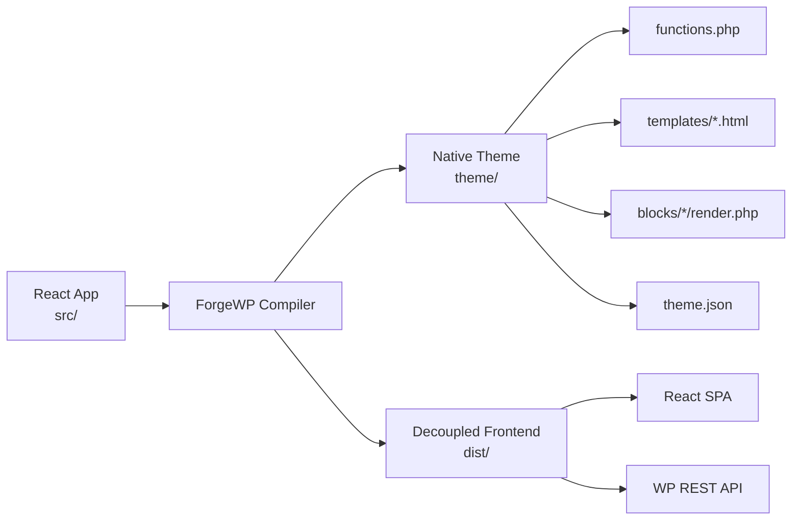

# ForgeWP — Phase 3 Content Guide
### "Show, Don't Tell" — Transitioning from Journal to Workshop

---

> [!IMPORTANT]
> You've earned trust through 19 days of philosophy. Now you have permission to open the workshop. The transition should feel like a **natural next step**, not a product announcement. Every post should still carry a story — the screenshot is the evidence, not the headline.

---

## Your Visual Identity Stack (pick these 4 and stick to them)

| Tool | Use for | Why |
|---|---|---|
| **Ray.so** | API hooks, short code snippets | Clean, modern gradient aesthetic — "framework energy" |
| **Carbon** | Terminal output, folder trees, longer code | Classic dev aesthetic, window frame reads as authentic |
| **Excalidraw** | Architecture diagrams | Hand-drawn feel = engineering sketch = trust |
| **Mermaid → SVG** | Compiler flow, pipeline diagrams | Clean, professional, zero design overhead |

> [!TIP]
> Standardizing on 4 tools gives your feed a **recognizable visual identity**. Your journal already has a voice. These tools give it a face.

---

## The Sequencing Strategy

Think of Phase 3 in three layers, introduced gradually:

```
Layer 1 (Days 20–24): Hooks & API Surface
  → The React-facing side. Feels familiar to developers.

Layer 2 (Days 25–30): The Compiler's Work
  → The invisible engine. This is your most unique content.

Layer 3 (Days 31+): Build Outputs & Architecture
  → The "wow" moment. The full picture comes together.
```

Don't reveal everything at once. Each feature should feel like a **discovery**, not a documentation dump.

---

## Layer 1: Hooks & API Posts (Days 20–24)

These are the easiest to start with. Pull real code from your project.

---

### Day 20 — Introducing `useWpTitle()` & `useWpContent()`

**The story:** I didn't want WordPress template tags scattered across React components.

**The code to screenshot (Ray.so):**

```tsx
// React source — looks like normal React
function PostCard() {
  const title   = useWpTitle();
  const excerpt = useWpExcerpt();
  const link    = useWpPermalink();

  return (
    <article>
      <h2>{title}</h2>
      <p>{excerpt}</p>
      <a href={link}>Read more →</a>
    </article>
  );
}
```

**The caption angle:**
> WordPress has `get_the_title()`, `get_the_excerpt()`, `get_permalink()`.
>
> In ForgeWP you write React hooks instead.
>
> During local dev, they return mock data so you can design freely.
>
> When exported, the compiler replaces each hook with its PHP equivalent.
>
> The component never knew it was in WordPress.

---

### Day 21 — Introducing `useWpCustomField()`

**The story:** ACF without the WordPress mental model.

**The code to screenshot (Ray.so):**

```tsx
function ProductCard() {
  const price    = useWpCustomField('product_price', '$0.00');
  const material = useWpCustomField('material_type', 'Merino Wool');
  const badge    = useWpCustomField('hero_badge', 'New Arrival');

  return (
    <div>
      <span>{badge}</span>
      <h3>{material}</h3>
      <p>{price}</p>
    </div>
  );
}
```

**The caption angle:**
> ACF custom fields work in ForgeWP without importing anything from WordPress.
>
> `useWpCustomField('field_name', defaultValue)`
>
> The default value shows up in local dev so you can design without a real database.
>
> In production, the compiler knows which PHP function to call instead.

---

### Day 22 — The `defineConfig()` Story

**The story:** The config file is the contract between the developer and the compiler.

**The code to screenshot (Ray.so) — from your real `wp.config.ts`:**

```ts
export default defineConfig({
  name: "Forge Commerce",
  slug: "forge-commerce",
  style: "shadcn",
  frameworkAdapter: "react",

  settings: {
    color: {
      palette: [
        { name: 'Brand Primary', slug: 'brand', color: '#C3B19F' },
        { name: 'Accent Amber', slug: 'accent', color: '#f59e0b' },
      ],
    },
    typography: {
      googleFonts: [
        'Mogra:wght@400',
        'Space Grotesk:wght@300;400;500;700',
      ],
    },
  },
});
```

**The caption angle:**
> This is `wp.config.ts` — the single file that tells ForgeWP everything it needs to know.
>
> Colors, fonts, theme name, style system.
>
> This becomes `theme.json` and `style.css` and `functions.php` in the compiled output.
>
> The developer never writes WordPress config files manually.

---

### Day 23 — The `useWpCart()` Hook

**The story:** WooCommerce without the WooCommerce mental model.

**The caption angle:**
> The hardest part of building ForgeWP wasn't the compiler.
>
> It was deciding what the React API should feel like.
>
> A hook like `useWpCart()` has to feel natural in React... and still map cleanly to WooCommerce's PHP data model.
>
> Getting that right took longer than I expected.

---

### Day 24 — The Full Hooks Inventory (as a folder/card)

**Show a card or Carbon screenshot listing all the hooks:**

```text
@forgewp/react — WordPress Data Hooks

── Content ────────────────────────────
useWpTitle()          → get_the_title()
useWpContent()        → the_content()
useWpExcerpt()        → get_the_excerpt()
useWpPermalink()      → get_permalink()

── Meta ───────────────────────────────
useWpDate()           → get_the_date()
useWpAuthor()         → get_the_author()
useWpFeaturedImage()  → get_the_post_thumbnail_url()

── Custom Fields ──────────────────────
useWpCustomField()    → get_post_meta()
useWpField()          → get_field() (ACF)

── Site ───────────────────────────────
useWpOption()         → get_option()
useWpMenu()           → wp_nav_menu()
```

**The caption angle:**
> Every hook in ForgeWP exists because a WordPress PHP function exists.
>
> The compiler knows the mapping.
>
> You write React. WordPress gets PHP.

---

## Layer 2: Compiler Posts (Days 25–30)
*This is your most unique content. No other framework can post this.*

---

### Day 25 — First "Compiler Snapshot"

**The story:** What does the compiler actually do?

**Format: Two Carbon screenshots side by side, or a Snappify split view**

```tsx
// React source — what you write
function PostCard() {
  const title = useWpTitle();
  const date  = useWpDate();

  return (
    <article className="post-card">
      <h2>{title}</h2>
      <time>{date}</time>
    </article>
  );
}
```

**Arrow: ↓ ForgeWP Compiler**

```php
<!-- Generated PHP template -->
<article class="post-card">
  <h2><?php the_title(); ?></h2>
  <time><?php echo get_the_date(); ?></time>
</article>
```

**The caption angle:**
> This is what the compiler does.
>
> `useWpTitle()` becomes `the_title()`.
>
> `useWpDate()` becomes `get_the_date()`.
>
> The JSX structure becomes a PHP template.
>
> WordPress never sees the React. The React never sees the PHP.

---

### Day 26 — Folder Comparison Post

**Use Carbon for a split tree screenshot:**

```text
React Source                  →  Native Theme Output
─────────────────────────        ────────────────────────────
forge-commerce/                  forge-commerce-theme/
  src/                             functions.php
    app/                           style.css
      page.tsx                     theme.json
      layout.tsx                   templates/
    components/                      index.html
      HeroSection.tsx                single.html
      ThreeProductViewer.tsx          page.html
    blocks/                        blocks/
      ProductCard/                   product-card/
        block.tsx                      block.json
        attributes.ts                  render.php
    .forgewp/                      assets/
      wordpress.tsx                  main.css
                                     main.js
```

**The caption angle:**
> Left side: what the developer writes in React.
>
> Right side: what WordPress receives.
>
> Same project. One compiler command.
>
> `pnpm forgewp export`

---

### Day 27 — The CLI

**Terminal screenshot (Carbon with a dark theme):**

```bash
$ pnpm forgewp export

  [build] Compiling React application...
  [parse] Scanning routes and page components
  [blocks] Compiling 4 Gutenberg blocks
  [templates] Generating PHP templates
  [assets] Processing CSS and JS bundles
  [i18n] Writing translation files
  [zip] Packaging forge-commerce.zip

  Export complete

  Theme folder   ./forge-commerce-theme
  ZIP            ./forge-commerce-theme.zip

  Install: Upload the ZIP to Appearance → Themes → Add New
```

**The caption angle:**
> One command.
>
> `pnpm forgewp export`
>
> A React application becomes an installable WordPress theme.
>
> No manual PHP. No template editing. No theme boilerplate.
>
> Just upload the ZIP.

---

### Day 28 — The Full CLI Surface (as a Carbon screenshot)

Pull from your **real CLI help output** — the `cli.js` printHelp function. This is genuinely impressive:

```bash
  ⚡ FORGEWP CLI — Fast visual frameworks for WordPress

  Commands:
    make:block <Name>        Scaffold a Gutenberg Block
    make:shell <Name>        Scaffold a parent shell layout
    make:post-type <slug>    Register a custom post-type
    make:loop <Name>         Scaffold a post-type loop feed
    make:page <Name>         Scaffold a WordPress Page Template
    make:island <Name>       Scaffold a selective hydration island
    make:editable <Name>     Scaffold an editable content schema
    make:form <Name>         Scaffold a form + component
    sync:routes              Sync sitemap menus with routes
    i18n:extract             Extract translation strings
    i18n:translate           Translate missing strings
    export                   Package theme as installable WP zip
    doctor                   Diagnostic check on project health
    analyze                  Hydration island & size report
    repair                   Auto-heal system internals
```

**The caption angle:**
> This is the full ForgeWP CLI.
>
> Every command is a generator.
>
> `make:block` scaffolds a type-safe Gutenberg block.
>
> `make:island` scaffolds a selective hydration island.
>
> `export` packages the entire theme as an installable ZIP.
>
> I spent a long time on this CLI because I believe the developer experience starts before the first component is written.

---

### Day 29 — Mermaid Compiler Flow Diagram

**Generate this with Mermaid, export to PNG/SVG, post it:**



**The caption angle:**
> This is the architecture in one diagram.
>
> Same React source.
>
> Two possible outputs.
>
> The developer decides at export time — not at design time.
>
> That was the idea from the beginning. Day 19 was the first time I saw it work.

---

### Day 30 — Excalidraw Architecture Diagram

Draw the full system:

```
[React Components]
       ↓
[ForgeWP Compiler]
  ├── analyzes JSX
  ├── replaces hooks with PHP
  ├── compiles blocks
  └── bundles assets
       ↓
[WordPress Theme]
  ├── PHP templates
  ├── Gutenberg blocks
  ├── theme.json (design tokens)
  └── functions.php
```

**The caption angle:**
> This is what happens between writing a React component and having a working WordPress site.
>
> The compiler is the bridge.
>
> It knows both worlds.

---

## Layer 3: Build Outputs & Benchmarks (Day 31+)

These are the "capability benchmarks" suggested — not Lighthouse scores.

---

### The "Code Reduction" Benchmark

```text
Traditional WordPress Theme        ForgeWP
─────────────────────────────      ──────────────────
header.php                         HeroSection.tsx
footer.php                  →      
functions.php                      
style.css                          
home.php                           
index.php                          
single.php                         

7 files, 3 languages               1 file, 1 language
```

---

### The "Build Outputs" Benchmark

```text
Same React Application

        pnpm forgewp export --target=theme
               ↓
        forge-commerce.zip (native WordPress theme)
               ↓
        Appearance → Themes → Install

        pnpm forgewp export --target=decoupled
               ↓
        dist/ (React SPA)
               ↓
        WordPress as headless CMS
```

---

### The Hydration Story (when ready)

```text
Static page component
  → 0 KB JavaScript hydration
  → Pure PHP render

Interactive island component
  → Selective hydration bundle
  → Only the island is React in the browser
```

---

## Post Format Template

Every post should follow this structure:

```
[Hook — 1–2 lines that create curiosity]

[Screenshot or diagram]

[Short explanation — what it is, why it exists]

[The "compiler bridge" — what it becomes in WordPress]

[Closing line — philosophical or forward-looking]
```

---

## What NOT to Post

> [!WARNING]
> Avoid becoming a benchmark framework. Don't post Lighthouse scores. Don't post "98 → 100" comparisons. Everyone does it. Nobody remembers it.

Instead, become the framework that makes **the invisible visible**. 

The transition between React and WordPress is mysterious to most developers. You have a compiler that exposes that transformation. Use it.

---

## The "Compiler Snapshot" Series

Consider making this a recurring format starting Day 25:

```
📸 Compiler Snapshot #1

React source →
[screenshot]

Generated PHP →
[screenshot]

Why the compiler made that choice:
[2–3 sentences]
```

This is content only ForgeWP can produce. No other framework sits between these two ecosystems this way.

---

## Recommended Post Order

| Day | Topic | Visual Type | Tool |
|-----|-------|------------|------|
| 20 | `useWpTitle` + `useWpExcerpt` | Code screenshot | Ray.so |
| 21 | `useWpCustomField` | Code screenshot | Ray.so |
| 22 | `defineConfig()` / `wp.config.ts` | Code screenshot | Ray.so |
| 23 | `useWpCart` story | Text + code | Ray.so |
| 24 | Full hooks inventory | Card/table | Carbon |
| 25 | Compiler Snapshot #1 | Before/after | Carbon + Snappify |
| 26 | Folder comparison | Split tree | Carbon |
| 27 | `pnpm forgewp export` terminal | Terminal | Carbon |
| 28 | Full CLI surface | Terminal | Carbon |
| 29 | Compiler flow diagram | Flow diagram | Mermaid |
| 30 | Full architecture | Sketch diagram | Excalidraw |
| 31+ | Build outputs benchmark | Side-by-side | Carbon |
| 32+ | Code reduction benchmark | Table | Carbon |
| 33+ | Hydration story | Diagram | Mermaid |
