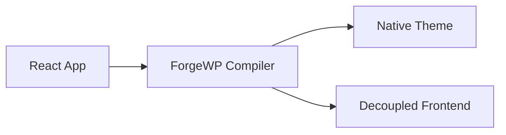

You actually don't need paid tools. The open-source/free ecosystem is excellent for this.

I'd standardize on **2–3 tools** so your journal has a recognizable visual identity.

---

# 1. Code Screenshots (⭐⭐⭐⭐⭐)

## Carbon

Probably the most popular.

* Beautiful syntax highlighting
* Lots of themes
* PNG/SVG export
* Window frame
* Line numbers
* Free

Perfect for:

* `useWpQuery()`
* `defineHydration()`
* Components
* Hooks
* Compiler APIs

I still think Carbon produces the cleanest screenshots.

---

## Ray.so

This has become my favorite.

Cleaner than Carbon.

Minimal.

Beautiful gradients.

Very "modern framework" aesthetic.

If I were posting ForgeWP, I'd probably use Ray.so most of the time.

Great for:

```tsx
const posts = useWpQuery({
    postType: "post",
    limit: 10,
});
```

Looks fantastic.

---

## Snappify

Another excellent option.

Supports:

* step-by-step animations
* split views
* callouts
* arrows
* annotations

Great when explaining the compiler.

Example:

```
React Component

↓

Compiler

↓

PHP
```

---

# 2. Folder Trees (⭐⭐⭐⭐⭐)

This is where Markdown shines.

## tree command

Literally use your terminal.

```
tree src
```

Outputs

```text
src
├── components
│   ├── Hero.tsx
│   └── Header.tsx
├── pages
│   └── index.tsx
└── hooks
    └── useWpQuery.ts
```

Paste into Carbon.

Done.

---

## tree + Markdown

Even better.

````md
```text
theme/
├── functions.php
├── style.css
├── templates/
├── blocks/
└── assets/
```
````

Then screenshot it.

Looks clean.

---

# 3. Compiler Output Diagrams (⭐⭐⭐⭐⭐)

Mermaid.

You're already familiar with it.

Example



Export to SVG.

Looks professional.

---

# 4. Architecture Diagrams

Excalidraw.

Amazing.

Seriously.

Hand-drawn look.

Looks like engineering notes.

People love it.

You can draw

```
React

↓

Compiler

↓

Theme
```

in 30 seconds.

---

# 5. Terminal Output

Warp terminal

or

Hyper

Both make terminal screenshots look great.

Example

```
pnpm forgewp export

✓ Parsing routes
✓ Generating templates
✓ Building assets
✓ Creating theme.zip

Done in 1.4s
```

People LOVE terminal screenshots.

---

# 6. API Cards

Figma

or

Penpot (free)

Create little API cards.

```
useWpQuery()

Fetch WordPress posts
using native WP_Query.
```

Very shareable.

---

# 7. Benchmark Charts

If you eventually compare:

Traditional WP

vs

ForgeWP

Use

Charts.css

or

Observable Plot.

Don't use Excel-looking charts.

---

# 8. Folder Comparison

I LOVE this idea.

```
React Source

src/
├── pages/
├── hooks/
└── components/

↓

Compiler

↓

Native Theme

theme/
├── functions.php
├── blocks/
├── templates/
└── style.css
```

This alone explains ForgeWP.

---

# My recommendation

If I were building ForgeWP's social presence, I'd use just these four:

### 🟣 Ray.so

For APIs.

---

### 🟢 Excalidraw

For architecture.

---

### 🔵 Carbon

For terminal/folder/code snippets.

---

### 🟠 Mermaid

For compiler flow diagrams.

---

## One last idea

I think ForgeWP has an opportunity that almost no framework has:

### **"Compiler Snapshots"**

Imagine a recurring series where every week you post something like:

```
React Source
```

⬇️

```
Generated PHP
```

⬇️

```
Rendered WordPress Page
```

Not to teach the API—but to let people peek inside the compiler.

Over time, readers won't just know **what** ForgeWP does; they'll start to understand **how it thinks**. That kind of transparency is rare, and it fits perfectly with the journal you've been building.
